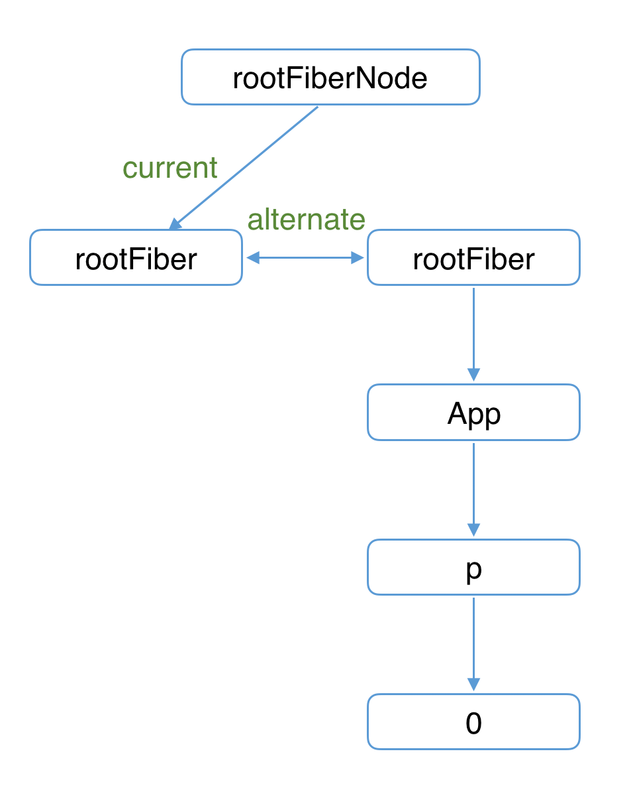
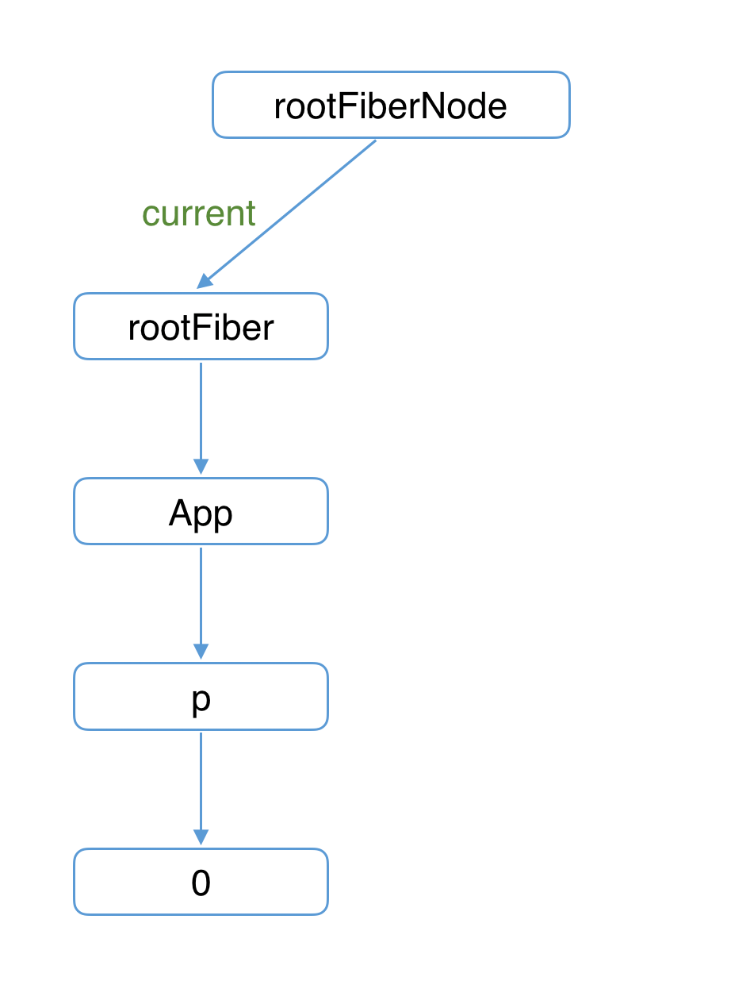
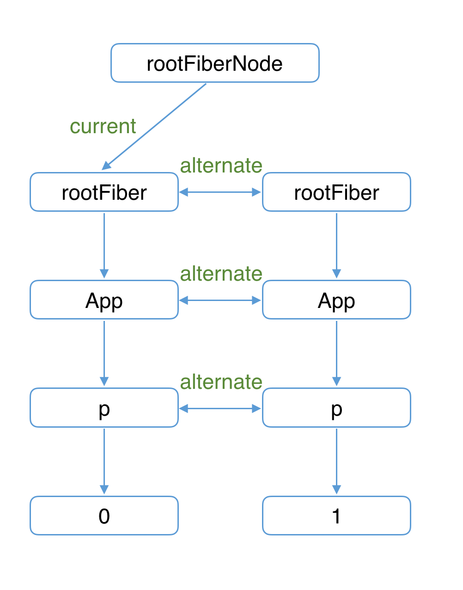
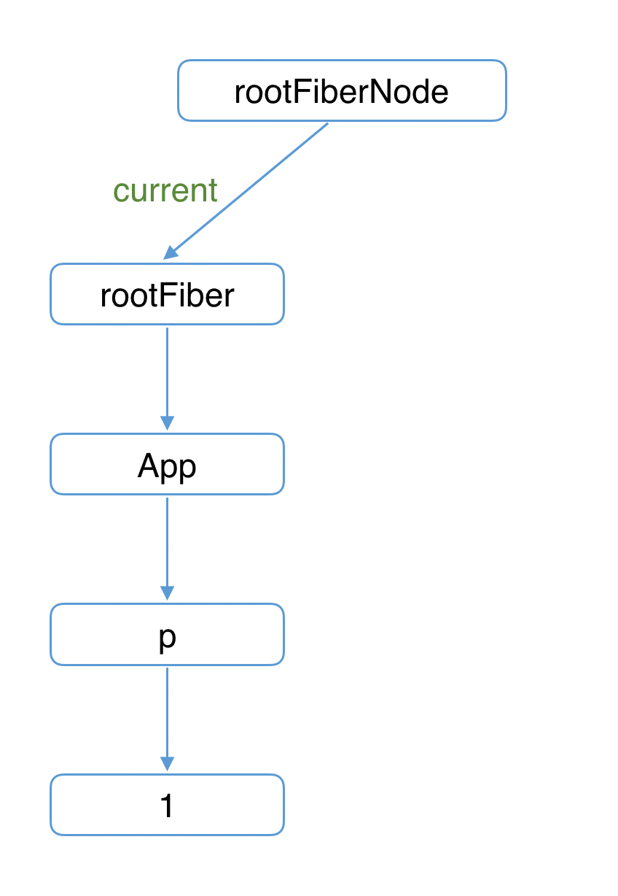

https://react.iamkasong.com/
# Render阶段
## 一、主要操作
- beginWork阶段：根据需要创建或复用fiber节点（reconcileChildren）
	- 由根节点向下深度优先遍历 
	- mount时：
		- 除fiberRootNode以外，current都是null。会根据fiber.tag不同，创建不同类型的子Fiber节点
	- update时
		- 如果current存在且满足复用条件，克隆current.child作为workInProgress.child，不需新建workInProgress.child。
		- 经过diff算法会带上effectTag
- mount或update，得到的子Fiber节点会赋值给workInProgress.child，作为本次beginWork返回值，并作为下次performUnitOfWork执行时workInProgress的传参。


- completeWork阶段
	- 由叶子结点往根节点回归 
	- 首次mount
		- 创建dom，赋值给stateNode
		- 将子孙dom插入到当前dom下，得到一个离屏的dom树
		- 初始化监听事件等属性
	- update：
		- updateQueue	: 
			- 对于原生节点HostComponent：diff节点的props收集成一个workInProgress.updateQueue，需要更新的属性key和value
			- 对于ClassComponent和HostRoot：会在setState的时候，就会创建一个update并入队列
			
		```
		Component.prototype.setState = function (partialState, callback) {
 			// ...
  			this.updater.enqueueSetState(this, partialState, callback, 'setState');
		};
		
		enqueueSetState(inst, payload, callback) {
		  // 通过组件实例获取对应fiber
		  const fiber = getInstance(inst);
		
		  const eventTime = requestEventTime();
		  const suspenseConfig = requestCurrentSuspenseConfig();
		
		  // 获取优先级
		  const lane = requestUpdateLane(fiber, suspenseConfig);

		  // 创建update
		  const update = createUpdate(eventTime, lane, suspenseConfig);
		
		  update.payload = payload;
		
		  // 赋值回调函数
		  if (callback !== undefined && callback !== null) {
		    update.callback = callback;
		  }
		
		  // 将update插入updateQueue
		  enqueueUpdate(fiber, update);
		  // 调度update
		  scheduleUpdateOnFiber(fiber, lane, eventTime);
		}
		```
		- 收集effectList
			- effectList中保存了需要执行副作用的Fiber节点。
			- 其中副作用包括
				- 插入DOM节点（Placement）
				- 更新DOM节点（Update）
				- 删除DOM节点（Deletion） 

## 二、双缓存树
- current属性：rootFiberNode的current永远指向当前页面上已渲染内容对应对Fiber树，被称为current Fiber树。
- current的初始指向：首次mount的时候，页面中还没有挂载任何DOM，rootFiberNode.current指向的rootFiber没有任何子Fiber节点（即current Fiber树为空）。

- 下图是首屏mount的情况，左图是在内存中构建fiber树，称为workInProgress Fiber树
右图，则是commit阶段渲染到页面之后，得到的currentFiber树。




- 当开启一次新的render时，会在内存中构建一棵新的workInProgress Fiber 树。
- 可复用：workInProgress fiber的创建可以复用current Fiber树对应的节点数据。
- 同样的，左图是：render阶段在内存中构建workInProgress Fiber 树，及其复用情况。
- 右图是：进入commit阶段渲染到页面上。渲染完毕后，workInProgress Fiber 树变为current Fiber 树。




## 三、什么时候会新建一个Fiber
- 初次mount的时候，除了rootFiberNode以外，节点的current都是null
- props或type都变化的时候，无法复用

注意：优先级不够的时候，会复用当前节点

## 四、mount如何插入真实dom节点
- render阶段会构建一棵离屏的DOM树
- mount时只会在rootFiber存在Placement effectTag。
- 那么commit阶段是如何通过一次插入DOM操作（对应一个Placement effectTag）将整棵DOM树插入页面的呢？
	- 原因就在于completeWork中的appendAllChildren方法。
	- 由于completeWork属于“归”阶段调用的函数，每次调用appendAllChildren时都会将已生成的子孙DOM节点插入当前生成的DOM节点下。那么当“归”到rootFiber时，我们已经有一个构建好的离屏DOM树。

## 五、effectList
- render阶段会收集effectList，用于commit阶段的具体dom操作
- effectList是由fiber节点组成的：每个执行完completeWork且存在effectTag的Fiber节点会被保存在一条被称为effectList的单向链表中。

```
                       nextEffect         nextEffect
rootFiber.firstEffect -----------> fiber -----------> fiber
```


# commit阶段
## 同步执行
- commit阶段里的操作都是同步执行，不可中断的

## 3个细分阶段
### 阶段一：before mutation(dom操作之前)
- 概览：主要做一些变量赋值的准备工作。如firstEffect，在commit的三个阶段都会用到他。
- 处理DOM节点渲染/删除后的 autoFocus、blur 逻辑。
- 调用getSnapshotBeforeUpdate生命周期钩子。
	- 为什么componentWillXXXX是不安全的
		- Stack Reconciler重构为Fiber Reconciler后，render阶段的任务可能中断/重新开始，对应的组件在render阶段的生命周期钩子（即componentWillXXX）可能触发多次。
		- getSnapshotBeforeUpdate是在commit阶段内的before mutation阶段调用的，由于commit阶段是同步的，所以不会遇到多次调用的问题。

- 调度useEffect
	- 如何调度useEffect的？
		- 使用scheduleCallback方法（由scheduler包提供），异步调度一个回调函数。
			- 在before mutation阶段：scheduleCallback中调度flushPassiveEffects
			- 在layout阶段：赋值操作 effectList = rootWithPendingPassiveEffects
			- 回调函数flushPassiveEffects被触发，内部遍历rootWithPendingPassiveEffects
		- 为什么要异步调度？

### 阶段二：mutation（执行dom操作）
- 概览：mutation阶段会遍历effectList，依次执行commitMutationEffects。根据effectTag调用不同的处理函数处理Fiber。
- 遍历effectList，对每个Fiber节点执行如下三个操作：
	- 根据ContentReset effectTag重置文字节点
	- 更新ref
	- 根据effectTag分别处理
		- Placement：根据DOM兄弟节点是否存在决定调用parentNode.insertBefore或parentNode.appendChild执行DOM插入操作。
		- Update：
			- 函数组件：执行所有useLayoutEffect hook的销毁函数
			- HostComponent：最终会在updateDOMProperties中将render阶段 completeWork中为Fiber节点赋值的updateQueue对应的内容渲染在页面上。
		- Delete：
			- 递归调用Fiber节点及其子孙Fiber节点中fiber.tag为ClassComponent的componentWillUnmount生命周期钩子，
			- 从页面移除Fiber节点对应DOM节点
			- 解绑ref
			- 调度useEffect的销毁函数
		
### 阶段三：layout阶段（dom操作之后）
- 可以访问到真实dom了，可参与dom的layout
- 回调函数的调用
	- ClassComponent:他会通过current === null？调用componentDidMount或componentDidUpdate 
	- 对于FunctionComponent，他会调用useLayoutEffect hook的回调函数。
	- 调用setState和ReactDom.render的回调函数
- ref处理：获取DOM实例，更新ref
- 性能追踪相关。
	


## useEffect 和 useLayoutEffect
```
const App = () => {
  const [count, setCount] = React.useState(0);
  
  React.useLayoutEffect(() => {
    if (count === 0) {
      const randomNum = 10 + Math.random() * 200;
      setCount(randomNum);
    }
  }, [count]);

  return (
      <div onClick={() => setCount(0)}>{count}</div>
  );
}

ReactDOM.render(<App/>, document.getElementById('app'));
```
使用useLayoutEffect是同步更新useLayoutEffect中的回调函数的，看不到数字从 0 变成随机数的过程。
但是useEffect则能看到0的出现

# UpdateQueue
## 为什么UpdateQueue会有多个update
- 多次setState

```
onClick() {
  this.setState({
    a: 1
  })

  this.setState({
    b: 2
  })
}
```

## Fiber节点和UpdateQueue的关系
- 一个Fiber节点同时最多存在2个UpdateQueue
	- current fiber保存的updateQueue
	- workInProgress fiber保存的updateQueue
	- 当commit完成时，会将workInPrgress fiber的updateQueue赋值给current fiber的updateQueue
- UpdateQueue的数据结构

```
{
		 // 本次更新前的旧state
		 baseState: fiber.memoizedState,
		 // 链表头
	    firstBaseUpdate: null,
	    // 链表尾
	    lastBaseUpdate: null,
	    shared: {
	      pending: null,
	    },
	    effects: null,
}
```

- shared.pending：
	- 触发更新时，产生的Update会保存在shared.pending中形成单向环状链表。
	- 当由Update计算state时这个环会被剪开并连接在lastBaseUpdate后面。
- 更新前UpdateQueue就存在Update？
	- 是由于某些Update优先级较低所以在上次render阶段由Update计算state时被跳过。


```
// baseUpdate
fiber.updateQueue.baseUpdate: u1 --> u2

==============现在我们在fiber上触发两次状态更新，这会产生两个新Update====================

// shared.pending
fiber.updateQueue.shared.pending:   u3 --> u4 
                                     ^      |                                    
                                     |______|
                                     
=================================进入render阶段===================================== 

// shared.pending环被剪开并连接到baseUpdate上
fiber.updateQueue.baseUpdate: u1 --> u2 --> u3 --> u4     

遍历此时的baseUpadte，根据每个update计算出最新的state（优先级低的状态会被跳过），也叫做memoizedState                             
```

# 为什么componentWillXXX不安全？
首次渲染时，优先级不够的更新会被跳过。

为了保证更新的连贯性，被跳过的Update及其后面所有Update会作为第二次渲染的baseUpdate和update，无论他们的优先级高低。

其中有些update会被执行2次。

```
// 英文后面的数字代表优先级
baseState: ''
shared.pending: A1 --> B2 --> C1 --> D2

// 优先更新了优先级为1的A1和C1
baseState: ''
baseUpdate: null
render阶段使用的Update: [A1, C1]
memoizedState: 'AC'

// 为了保持连续性，D2的更新会依赖C1，所以C1会被执行2次，componentWillXXX会执行2次
baseState: 'A'
baseUpdate: B2 --> C1 --> D2
render阶段使用的Update: [B2, C1, D2]
memoizedState: 'ABCD'
```