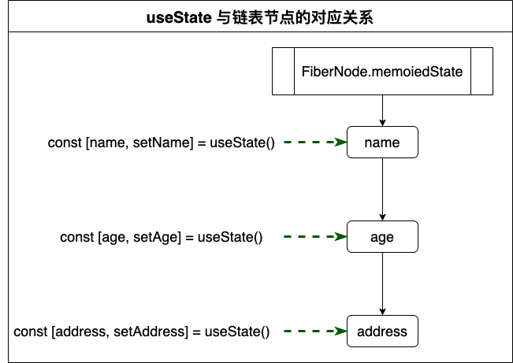

# react hooks原理
## 数据结构
```
export type Hook = {
	memoizedState: any,
	baseState: any,
	baseUpdate: Update<any, any> | null,
	queue: UpdateQueue<any, any> | null,
	next: Hook | null
}
```
## state存储
- 存在memoizedState，是一个链表
- 一个fiberNode里面，可以声明多个state

```
function Person() {
	const [name, setName] = useState('1')
	const [age, setAge] = useState(20)
	const [address, setAddress] = useState('Ginza')
}
```

- memoizedState是一个链表，来存储这些state，声明useState的顺序将会影响具体某个state值在链表中的位置

	
	
	
## setState更新
- state的update存在queue中，会形成环状单向链表

```
const [name, setName] = useState('1')
setName('张三')
setName('李四')
setName('王五')
```

 
 
- 为什么不能只保存最新一次的更新操作？

```
// 还有这样的语法
setName(name => name + 'a')
setName(name => name + 'ab')
setName(name => name + 'abc')
```
- setName底层
	- STEP1：创建一个update
	- STEP2：环状单向链表的操作
	- STEP3：开始调度更新

```
function dispatchAction(queue, action) {
	// 创建update
	const update = {
		action,
		next: null
	}
	// 环状单向链表操作
	if(queue.pending === null) {
		update.next = update
	} else {
		update.next = queue.pengding.next;
		queue.pending.next = update;
	}
	
	queue.pending = update
	                                                                        	                                                                                                                                                                                   
	// 调度更新
	schedule();
}

```

- 当只有一个update的时候

```
	queue.pending = u0 ------>|
						^	      |
						|--next--v
```

```
	queue.pending = u1 <--next-- u0
						|            ^
						v ----next---|
```

```
	queue.pending = u2 <---next-- u1 <---next--- u0
						|				                ^
						v-------------next-----------|
```

- 特性：
	- queue.pending 永远指向最新增加的update
	- 最新增加的update，和最早增加的update会连接在一起 
## useEffect
- 存在updateQueue中
- 同样是以链表的形式，挂载在FiberNode.updateQueue
- 阶段一：收集effect
	- mount阶段：构建初始的updateQueue，updateQueue是有Effect对象串连而成的

	```
		const effect: Effect = { 
			tag: HookEffectTag //打上的tag标签，指示在commit阶段应该如何更新
			create: function // 用户使用useEffect传入的函数体
			destroy: function // 执行useEffect入参函数，返回的销毁函数
			deps: array // 依赖项列表
			next: (null: any) //指针，指向下一个effect
		};
	```
	
	- update阶段：判断传入的依赖列表是否有变化，打上对应的effectTag

- 阶段二：commit Effect
	- 遍历链表
	- Effect.tag为NoHookEffect，则跳过
	- 执行Effect.destroy，如果有的话
	- 再执行Effect.create，并将返回结果赋值给Effecy.destroy