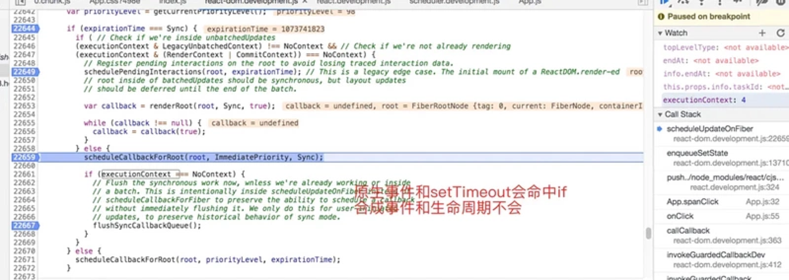

# setState是同步还是异步的

## 先看几个结论
- setTimeout和原生事件：同步的
- 合成事件和生命周期中：异步的，且会对多个setState操作进行合并计算

## 关键在于executionContext变量
- 在进行合成事件和生命周期处理的时候，先赋值

```
	// 合成事件
	executionContext |= DiscreteEventContext
	
	
	// 生命周期中
	executionContext &= ~BatchedContext;
	executionContext |= LegacyUnbatchedContext
	
	// 默认
	executionContext = NoContext
	
```

- 更新的时候，如果是NoContext，则直接执行


## 总结
- 关键在于executionContext变量的赋值
- 默认是NoContext
	- 会立马清空callback队列 
- 合成事件和生命周期中
	- 进入到react的调度机制中