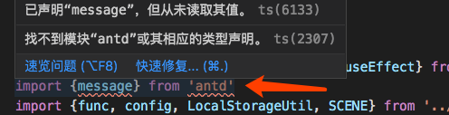

#ts 使用记录
## tslint/ eslint
###1、allowSyntheticDefaultImports
我们初次使用tsx开发react项目时，肯定会对他的模块引入方式觉得很奇怪吧

在tsx里面，我们需要这样引入React：

import * as React from 'react'
而 在js 中我们可以这样引入：

import React,{Component, useState} from 'react'
 

从上面可以看出，其实使用tsx的方式引入不是很方便，因为React使我们每个React组件都必须要引入的,因为jsx语法需要依赖React,而当我们要实现类式组件或者使用hook时，我们需要用到Component和useState等，如果使用tsx的方法，我们需要这样写：

import * as React from "react";
 
class Demo extends React.Component{
    // ....
}
 
function Demo1(){
    const [name,setName] = React.useState("kiner");
    // ....
}
这样是比较繁琐的，那么，有没有什么办法可以让我们在tsx中使用js的模块引入方式来引入模块呢 ？

答案是肯定的，我们只需要再tscofing.json的“compilerOptions”配置下面加入如下选项即可

{
  "compilerOptions": {
    "allowSyntheticDefaultImports": true
  }
}

## webpack-dev-server
用nginx做代理服务器，访问时显示：Invalid Host header

经查是因为新版的webpack-dev-server出于安全考虑，默认检查hostname，如果hostname不是配置内的就不能访问。这样有2中方法，一种是设置跳过host检查，一种是直接host设置成你的地址。

1、关闭host检查

可以在build目录下的webpack.dev.conf.js文件，devServer下添加disableHostCheck: true，跳过检查


同样的原理，可以在package.json文件修改scripts命令:webpack-dev-server --disableHostCheck=true


2、设置成你的host，加入你的host是xxx.com，同样2中方法，修改配置文件，和script命令

在config目录下修改index.js文件的host，这个默认是localhost，可修改成   xxx.com
package.json的script语句: webpack-dev-server --host=xxx.com或者--public=xxx.com

3、配了nginx反向代理，webscoket握手失败

```
const server = new WebpackDevServer(compiler, {
    hot: true,
    inline: true,
    host: 'local.jd.com',
    port: 3000
    // disableHostCheck: true
});
server.listen(3000, 'local.jd.com', function (err) {
    if (err) throw err
})
```

## 找不到模块antd


```
 // tsconfig.json
 {	
 	"compilerOptions": {
 		"module": "es6",
   		"moduleResolution": "node",
 	}
 }
```
写了module: 'es6'，一定要写上moduleReolution: 'node'，否则会默认走moduleReolution: 'classic'这个配置。导致找不到模块

@TODO: 具体原因回来看看

## react hooks

```
const TagFilter = (props:TagFilterPropsType):JSX.Element => {
    const {scene} = props
    const [tagList, setTagList] = useState({})
    const [tagSelected, setTagSelected] = useState({})
    const getTagList = useCallback(async () => {
        const tagList = await Tpl.getTag({
            scene
        })
        const resultTag = func.addressTagGroup(tagList)
        setTagList(resultTag)
    }, [])
  
    return <div className='atomlive-filterBar'>
        {
            Object.keys(tagList).map((tagId, index)=>{
                const tag = tagList[tagId]
                return <TagRow key={index} title={tag.name} tags={tag.tags} onSelectTag={(id) => {
                    setTagSelected({
                        ...tagSelected,
                        [tagId]: id
                    })
                    /**
                    	写成这样无效
                    	tagSelected[tagId] = id
                    	setTagSelected(tagSelected)
                    	需要一个新对象，否则一直是空对象{}
                    */
                }} />
            })
        }
      
    </div>
}
const TagRow = (props: TagRowProps) => {
    const {title, tags, onSelectTag} = props
    const [activeIndex, setActiveIndex] = useState(0)

    const onClick = useCallback((index, tagId)=>{
        setActiveIndex(index)
        onSelectTag(tagId)
    }, [onSelectTag])
    /*
    	一定要写依赖于onSelectTag
    	否则一直只有一个key
    	{
    		5c51095b82acdd181de976e3: "5c51095c82acdd181de97719"
    	}
    */
    return <div className="atomlive-filterBar-row">
        <span>{title}: </span>
        <div className="atomlive-filterBar-row-options">
            {
                tags.map((item, index) =>{
                    return <span key={index} className={activeIndex === index ? 'active': ''} onClick={()=>{onClick(index, item.id)}}>{item.name}</span>
                })
            }
        </div>
    </div>
}
```