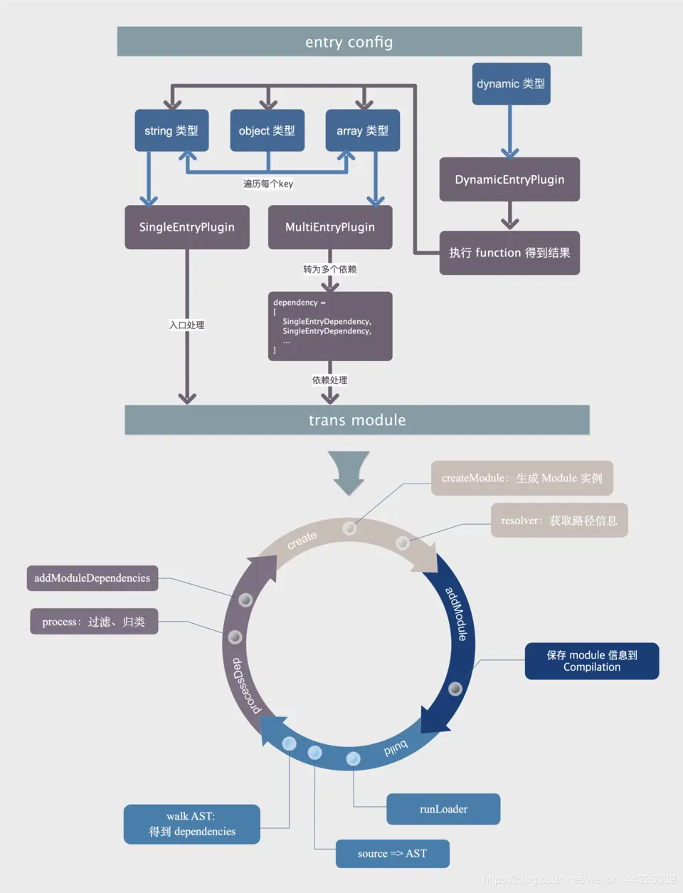
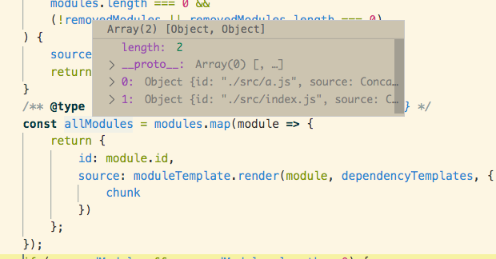
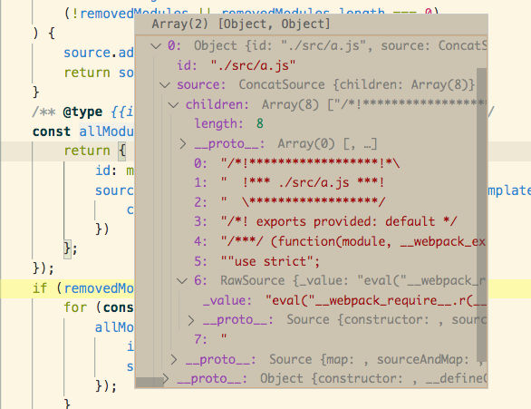
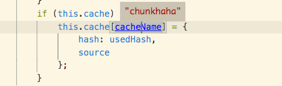
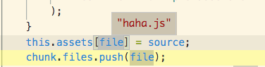

# Webpack源码阅读
### STEP1 初始化阶段（调用compiler.compile之前的阶段）
#### 对应代码
```
	const compiler = webpack(config)
```
#### 一、new一个compiler对象
- config是一个对象，那么new一个Compiler
- 如果config是一个数组，那么new一个MultiCompiler
	- 遍历config，逐个调用webpack(config) 

#### 二、挂载插件
- 处理内部插件：自动new一个NodeEnvironmentPlugin，并调用apply方法
	- 作用：
		- 一个内部插件， 用于将nodejs文件系统应用到compiler
	- 注意：
		- 需要区分EnvironmentPlugin
		- EnvironmentPlugin:挂载process.ENV.xxxx 
- 处理用户自定义插件：遍历config.plugin字段
	- plugin入参和this都是前面new出来的compiler 
	- 调用插件的app
	- ly方法，apply方法里面有tap
	
	```
		if (typeof plugin === "function") {
			plugin.call(compiler, compiler);
		} else {
			plugin.apply(compiler);
		}
	```	
	
#### 三、调用钩子
- compiler.hooks.environment.call();
- compiler.hooks.afterEnvironment.call();

#### 四、处理config里的更多用户配置
- new了一堆的plugin，再调用apply方法，入参一般是compiler
	- 针对配置项目，调用的plugin
	- library: LibraryTemplatePlugin
	- externals: ExternalsPlugin
	- devtool: 
		- EvalSourceMapDevToolPlugin
		- SourceMapDevToolPlugin
		...
	- optimization:
		- removeAvailableModules
		- removeEmptyChunks
		- sideEffects
		- splitChunks
		- runtimeChunk
		- moduleIds
		- chunkIds 
	- JavascriptModulesPlugin
	- JsonModulesPlugin
	- JsonModulesPlugin
	- EntryOptionPlugin 
	- CompatibilityPlugin
- 触发钩子：compiler.hooks.afterPlugins
- 触发钩子：compiler.hooks.afterResolvers.call(compiler);

#### 五、run相关钩子触发
- compiler.hooks.beforeRun
	-	inputFileSystem处理
- compiler.hooks.run

### STEP2 build阶段

#### 一、调用钩子
- compiler.hooks.beforeCompile
- compiler.hooks.compile
webpack/lib/Compiler.js (run > this.compile)

#### 二、创建compilation对象
- Compilation继承自Tapable
- 调用钩子
	- this.hooks.thisCompilation.call(compilation, params);
	- this.hooks.compilation.call(compilation, params);
- 保存compiler的引用
- chunks数组初始化
- modules数组初始化
- 初始化template
	- mainTemplate
	- chunkTemplat
	- hotUpdateChunkTemplate
	- runtimeTemplate
	- modulesTemplates
		- javascript：生成js文件源码
		- webassembly

#### 三、调用compile.hooks.make钩子

#### 四、处理入口文件
- 单入口、多入口、动态入口
	-  string 类型： new SingleEntryPlugin 
	-  array 类型： new MultiEntryPlugin 
	-  object 类型：遍历key，再根据类型判断是new SingleEntryPlugin 还是MultiEntryPlugin
	-  函数或promise类型：DynamicEntryPlugin，区别于上面几种多了一层函数或promise执行
- 相关钩子：SingleEntryPlugin.js初始化阶段就监听了compiler.hooks.make钩子

```
	compiler.hooks.make.tapAsync(
		"SingleEntryPlugin",
		(compilation, callback) => {
			const { entry, name, context } = this;
			const dep = SingleEntryPlugin.createDependency(entry, name);
			compilation.addEntry(context, dep, name, callback);
	}
);
```
- 初始化入口
	- 入口也作为一个依赖`dependency`，由SingleEntryPlugin.createDependency创建（返回的是SingleEntryDependency）
	- compilation.addEntry从入口这个dependency开始处理
		- 对于入口文件来说还会执行this._preparedEntrypoints.push(slot); 
		
```
const slot = {
			name: name,
			// TODO webpack 5 remove `request`
			request: null,
			module: null
		};
```
- 创建module
	- 由模块工厂`dependency`创建module：SingleEntryDependency对应的moduleFactory对应是NormalModuleFactory
	- moduleFactory.create创建一个NormalModule，传递给回调函数
	- 存入Compilation.modules和_modules 数组
	
	```
	// 一个NormalModule的常见初始化的属性
	
	
	_cachedSources:Map(0) {}, // 编译过的模块源码会被缓存起来
	
	//chunk数组
	_chunks:Set(0) {_sortFn: , _lastActiveSortFn: null, _cache: undefined, …}, 
	
	
	blocks:Array(0) [],
	
	buildInfo:Object {cacheable: false, fileDependencies: Set(0), contextDependencies: Set(0)},
	
	buildMeta:Object {},
	
	buildTimestamp:1595205991768,
	
	built:true,
	
	chunksIterable:Set(0),
	
	context:"/Users/liuxinyi6/Documents/VscodeProject/FengRenPlatform-1211/src",
	
	parser:Parser {_pluginCompat: SyncBailHook, hooks: Object, options: Object, …},
	
	rawRequest:"/Users/liuxinyi6/Documents/VscodeProject/FengRenPlatform-1211/src/index.js",
	
	request:"/Users/liuxinyi6/Documents/VscodeProject/FengRenPlatform-1211/node_modules/babel-loader/lib/index.js??ref--4-0!/Users/liuxinyi6/Documents/VscodeProject/FengRenPlatform-1211/src/index.js",
	
	resource:"/Users/liuxinyi6/Documents/VscodeProject/FengRenPlatform-1211/src/index.js",
	
	userRequest:"/Users/liuxinyi6/Documents/VscodeProject/FengRenPlatform-1211/src/index.js",
	
	```
- 调用loader处理module(runLoader)
	- step1：构建loader上下文
		- loader context:就是一个封装了一系列函数的对象(包括emitFile发送文件、执行函数exec、错误报告)
	- step2：引入loader包:require(loader.path)
	- step3：运行loader，得到一个result，有如下关键属性
		- resourceBuffer：二进制源码
		- source:loader解析后的源码，去掉了export、import的
		- sourceMap = result.result.length >= 1 ? result.result[1] : null;

### 五、从入口module解析依赖
// Compilation.js

调用buildModule -> NormalModule.doBuild

- 调用acorn解析代码，
	- 得到AST，查找所有依赖对象，把依赖push到dependencies数组里
	- 查找依赖对象的流程为： program事件 -> detectStrictMode -> prewalkStatements -> walkStatements。这个过程中会给 module 增加很多 dependency 实例。
	- 每个 dependency 类都会有一个 template 方法，并且保存了原来代码中的字符位置 loc，在最后生成打包后的文件时，会用 template 的结果替换 loc 部分的内容。所以最终得到的 dependency 不仅包含了文件中所有的依赖信息，还被用于最终生成打包代码时对原始内容的修改和替换
	- 依赖对象的关键内容
	
	```
		/*
		 *入口文件假设是/home/VscodeProject/myProject/src/index.js
		 *依赖./testClick.js
		 */
		 
		// 处理依赖之后的module对象，增加了dependencies等属性
		{
			buildHash: '81480eeb2ddee378e2e67e7a8db97b96',
			
			context:"/home/VscodeProject/myProject/src",
			
			rawRequest:"/home/VscodeProject/myProject/src/index.js",
			
			request:"/home/VscodeProject/myProject/node_modules/babel-loader/lib/index.js??ref--4-0!/home/VscodeProject/myProject/src/index.js"
			
			dependencies: {...}，
			blocks: {...},
			variables: {...}
		}
	```
	```
		// module.dependency
		HarmonyImportSpecifierDependency {
			
			// 记录依赖出现的位置
			loc:SourceLocation {start: Position, end: Position}
		
			
			originModule:NormalModule {dependencies: Array(11), blocks: Array(0), variables: Array(0), …}
		
			// 	依赖的请求路径
			request:"./testClick"
						
			userRequest:"./testClick"
			
			weak:false
		}
	```
	- HarmonyImportSpecifierDependency：from后面的源， import a from './testClick'
	- HarmonyImportSideEffectDependency：from前面的import的对象
	- 根据依赖出现的顺序（loc属性里的位置定位）进行排序，
- block和dependency的区别
	- 出现block的情况：当我们使用 webpack 的懒加载时 import('xx.js').then() 的写法，在 parse 阶段，在该模式下，会生成一个 ImportDependenciesBlock 类型的依赖，并加入到 module.block 中。 
- afterBuild
	- 往entries数组中push这个入口module
- 递归解析依赖：处理module的dependencies数组

	```
		const afterBuild = () => {
			if (addModuleResult.dependencies) {
				this.processModuleDependencies(module, err => {
					if (err) return callback(err);
					callback(null, module);
				});
			} else {
				return callback(null, module);
			}
		};
	```
- 总结一下模块之间的关系
 
图自https://blog.csdn.net/weixin_44326389/article/details/103761398

	```
	_preparedEntrypoints:
	  \
	    module: demo.js module
				  |\
				  |  HarmonyImportSideEffectDependency
				  |    module: a.js module
				   \
				     HarmonyImportSpecifierDependency
				       module: a.ja module
	```

### STEP3 生成最终文件
#### 一、调用compilation结束方法
调用compilation.finish， compilation.seal

上一步STEP2得到了modules数组

#### 二、从preparedEntryPoints构建chunk
- chunk产生的可能
	- entry配置
	- 异步分包：import('./foo.js').then(bar => bar())
	- 有关 optimization 优化 chunk 生成的配置：最终 webpack 会将 webpack runtime chunk 单独抽离成一个 chunk 后再输出成一个名为runtime-chunk.js的文件。

	```
	module.exports = {
	  optimization: {
	    runtimeChunk: {
	      name: 'runtime-chunk'
	    }
	  }
	}
	```

- 遍历preparedEntryPoints
- 把preparedEntryPoint的name、module赋值给chunk
#### 三、创建完chunk之后，调用一堆钩子

```
	afterChunks
	optimize
	optimizeModulesBasic
	optimizeModules
	optimizeModulesAdvanced
	afterOptimizeModules
	optimizeChunksBasic
	optimizeChunks
	optimizeChunksAdvanced
	afterOptimizeChunks
	optimizeTree
```
调用onCompiled的回调函数
将this.assets[chunkId]的编译后的源码输出到最终文件
#### 四、创建assets
- buildChunkGraph 构建依赖关系图
- createModuleAssets
- createChunkAssets
	- 1、先获取文件路径getAssetPath 
		
	- 2、renderChunkModules:
		
		```
		const allModules = modules.map(module => {
			return {
				id: module.id,
				source: moduleTemplate.render(module, dependencyTemplates, {
					chunk
				})
			};
		});
		```
		
		- modules是normalModule构成的数组，记录了文件路径（request）、dependencies(根据解析出来的ast封装的对象，import、export、const声明都有对应的dependency，记录了loc位置、导出或引入的变量名称)
			 
		- allModules是每个module经过render之后的东西，主要有2个内容，一个是id，用相对路径标识，另一个是source数组，代码语句数组，用来连接成编译后代码
			 
	- 看一下Rawsource里面是个什么
		
	```	
	// RawSource
			
	"eval("__webpack_require__.r(__webpack_exports__);\n
	
	/* harmony import */ 
	var _a_js__WEBPACK_IMPORTED_MODULE_0__ = __webpack_require__(/*! ./a.js */ \"./src/a.js\");\n\n
	
	var b = _a_js__WEBPACK_IMPORTED_MODULE_0__[\"default\"];
	
	//# sourceURL=[module]\n//# sourceMappingURL=data:application/json;charset=utf-8;base64,eyJ2ZXJzaW9uIjozLCJzb3VyY2VzIjpbIndlYnBhY2s6Ly8vLi9zcmMvaW5kZXguanM/YjYzNSJdLCJuYW1lcyI6WyJiIiwiYSJdLCJtYXBwaW5ncyI6IkFBQ0E7QUFBQTtBQUFBO0FBQ0EsSUFBSUEsQ0FBQyxHQUFHQyw2Q0FBUiIsImZpbGUiOiIuL3NyYy9pbmRleC5qcy5qcyIsInNvdXJjZXNDb250ZW50IjpbIlxuaW1wb3J0IGEgZnJvbSAnLi9hLmpzJ1xudmFyIGIgPSBhO1xuIl0sInNvdXJjZVJvb3QiOiIifQ==\n
	//# sourceURL=webpack-internal:///./src/index.js\n");"
	```
	- 把allModules数组里的module源码语句数组，拼接起来成为一个大的字符串，也就是source
	- 缓存编译后的source， 
	



- 创建并写入文件
- 调用编译完成钩子
compiler.hooks.afterCompile

STEP4：最终生成文件介绍

- 整体来看：是一个立即执行函数
	- 入参： 
		- modules数组，由module对象组成
		- module对象key为文件路径，value是一个函数，函数体是该模块的代码
		
- 代码加载到浏览器以后，从入口模块开始执行
	- 调用__webpack_require__
		- 读取Map中的对象，执行对应的函数
		- 加载过的模块存到installedModules中
		
- 异步方法：
	- 单独打成一个包
	- 用户触发加载动作时
		- step1: 动态地在head标签中创建一个script标签，然后发送一个http请求加载模块
		- step2: 模块加载完成以后，自动执行其中代码
		- step3: 更改缓存中模块的状态


## 总结
### 初始化
- 参数合并与处理
- 创建compiler对象
- 挂载plugin
	- environmentPlugin初始化文件系统 
- 触发钩子运行编译
	- compiler.hooks.run
	
### build阶段
- 调用compilation钩子
- 创建compilation对象
	- chunks数组
	- modules数组
- 针对入口类型，创建对应的plugin
	- 单入口对应SingleEntryPlugin，里面监听了make钩子  
- 触发make钩子
- 创建入口module
	- NormalModule
- 调用loader解析文件
	- 初始化loader上下文
	- require loader
	- 执行loader，得到的结果：二进制的source，source，sourceMap
- 调用acorn解析AST，找到依赖的模块 和 代码出现的位置
- 递归解析模块，将收集到的依赖文件都存入modules数组
### 生成最终文件
## 


