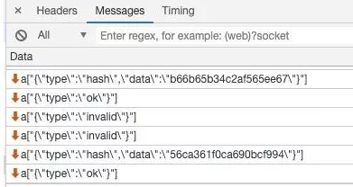
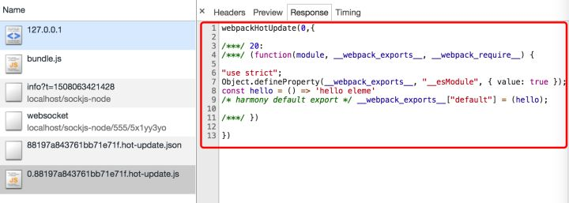

# ahsdkjh
## 服务端watch文件，并推送更新
- 调用webpack的api：compiler.watch 
- 文件变化时，重新编译输出bundle.js。devServer下，输出到内存中（memory-fs库操作）
- devServer通知客户端文件：
	- 启动devServer的时候，建立了webSocket唱链接
	- devServer监听了compile.done事件，当compile完成后，将编译打包后的新模块hash值发送到浏览器端
	
```
// watch逻辑

setupDevMiddleware() {
    this.middleware = webpackDevMiddleware(
        this.compiler,
        Object.assign({}, this.options, { logLevel: this.log.options.level })
    );
}
// webpack-dev-middleware/index.js
if (!options.lazy) {
    context.watching = compiler.watch(options.watchOptions, (err) => {
    ...
    });
}

// 输出文件到内存
fileSystem = fs;
} else if (isMemoryFs) {
    fileSystem = compiler.outputFileSystem;
} else {
    fileSystem = new MemoryFileSystem();
    compiler.outputFileSystem = fileSystem;
}
// 发送hash值
const addHooks = (compiler) => {
	...
	done.tap('webpack-dev-server', (stats) => {
	    this._sendStats(this.sockets, this.getStats(stats));
	    this._stats = stats;
	});
};
...
_sendStats(sockets, stats, force) {
	...
	this.sockWrite(sockets, 'hash', stats.hash);
	if (stats.errors.length > 0) {
	    this.sockWrite(sockets, 'errors', stats.errors);
	} else if (stats.warnings.length > 0) {
	    this.sockWrite(sockets, 'warnings', stats.warnings);
	} else {
	    this.sockWrite(sockets, 'ok');
	}
}
``` 
## 客户端对服务器的消息做出响应
- entry逻辑被修改了！所以最后编译出来的bundle文件才能监听到websocket
- plugin中也注入了HotModuleReplacementPlugin，插件的主要功能：
	- 注入HMR runtime逻辑？？
	- 找到修改的模块，生成一个补丁js文件和更新描述json文件
- 接收到websocket消息
	- 消息包括：hash值，type：消息类型
	- 通知webpack客户端代码
	- webpack就通过jsonp的方式请求服务器，得到需要更新的模块的代码
	
 
	
 

```
// 对entry增加一个dev-server的入口文件
let hotEntry;
if (options.hotOnly) {
    hotEntry = require.resolve('webpack/hot/only-dev-server');
} else if (options.hot) {
    hotEntry = require.resolve('webpack/hot/dev-server');
}
...
if (hotEntry && checkInject(options.injectHot, config, true)) {
    additionalEntries.push(hotEntry);
}
config.entry = prependEntry(config.entry || './src', additionalEntries);

// 接收到的消息类型
hash(hash) {
    status.currentHash = hash;
},
...
ok() {
        sendMessage('Ok');
    if (options.useWarningOverlay || options.useErrorOverlay) {
        overlay.clear();
    }
    if (options.initial) {
        return (options.initial = false);
    } // eslint-disable-line no-return-assign
    reloadApp(options, status);
}

// reloadApp里面做了什么
if (hot) {
    ...
    const hotEmitter = require('webpack/hot/emitter');
        hotEmitter.emit('webpackHotUpdate', currentHash);
    if (typeof self !== 'undefined' && self.window) {
        self.postMessage(`webpackHotUpdate${currentHash}`, '*');
    }
}

// 发消息给webpack让它接手文件更新了
var hotEmitter = require("./emitter");
    hotEmitter.on("webpackHotUpdate", function(currentHash) {
        lastHash = currentHash;
        if (!upToDate() && module.hot.status() === "idle") {
            log("info", "[HMR] Checking for updates on the server...");
            check();
        }
    });
    
// webpack/lib/HotModuleReplacement.runtime
    function hotCheck(apply) {
    ...
        return hotDownloadManifest(hotRequestTimeout).then(function(update) {
            ...
                hotEnsureUpdateChunk(chunkId);
            ...
            return promise;
        });
    }
```
## webpack客户端对文件内容进行热替换
- 找出过期模块及其依赖
- 从installedModules缓存中，删除过期的模块和依赖
- 将新的模块添加到modules中，下次执行__webpack_require__时候就会获取到新的模块代码了

```
// 1、获取过期模块和依赖
function getAffectedStuff(updateModuleId) {
    var outdatedModules = [updateModuleId];
    var outdatedDependencies = {};
    ...
    return {
        type: "accepted",
        moduleId: updateModuleId,
        outdatedModules: outdatedModules,
        outdatedDependencies: outdatedDependencies
    };
}

// 2、从cache和子模块中移除module
delete installedModules[moduleId];
delete outdatedDependencies[moduleId];
for (j = 0; j < module.children.length; j++) {
    ...
}
// remove outdated dependency from module children
var dependency;
var moduleOutdatedDependencies;
for (moduleId in outdatedDependencies) {
...
}

// 3、将新的模块添加到modules中
for (moduleId in appliedUpdate) {
	if (Object.prototype.hasOwnProperty.call(appliedUpdate, moduleId)) {
		modules[moduleId] = appliedUpdate[moduleId];
	}
}
```