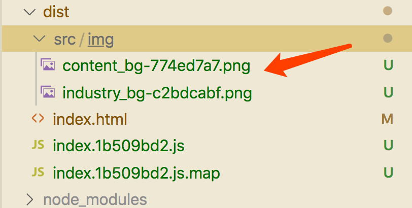
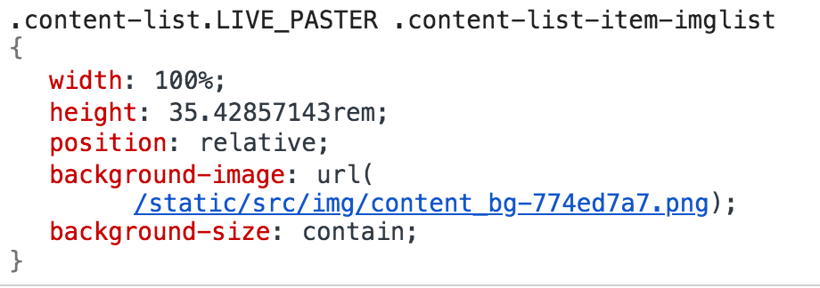
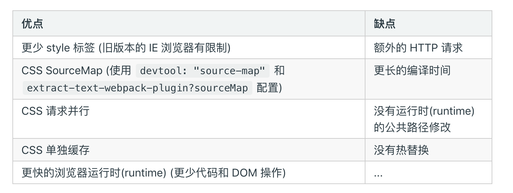

# webpack常用配置
## 打包图片字体文件

### url-loader
- 常用于打包图片、字体
- 作用：将原文件转成base64
	- 设置limit限制需要转化的文件大小，如果超过一个范围，那么会默认使用file-loader打包
	
### file-loader
- 将文件迁移到最终的打包目录
 
 

## 判断测试/正式环境
### EnvironmentPlugin
- process.env.XXXX
### DefinePlugin
- 定义全局变量

## CSS打包
-  extract-text-webpack-plugin 或 mini-css-extract-plugin
-  webpack4.x 不支持使用extract-text-webpack-plugin问题
	- 解决方法：
	
		- 第一种：使用extract-text-webpack-plugin@next 和原本的使用一样
	
		- 第二种：使用mini-css-extract-plugin代替
 

```
const MiniCssExtractPlugin = require('mini-css-extract-plugin');

// module
{
    test: /\.less$/,
    use: [
        MiniCssExtractPlugin.loader,
        // 'style-loader',
        'css-loader',
        {
            loader: 'less-loader',
            options: {
                javascriptEnabled: true,
                plugins: [new LessPluginFunctions()]
            },
        }
    ]
}

 plugins: [
        ...C
        new MiniCssExtractPlugin({
            filename: 'style/style.css'
        })
        // new webpack.HotModuleReplacementPlugin(),
    ]
```