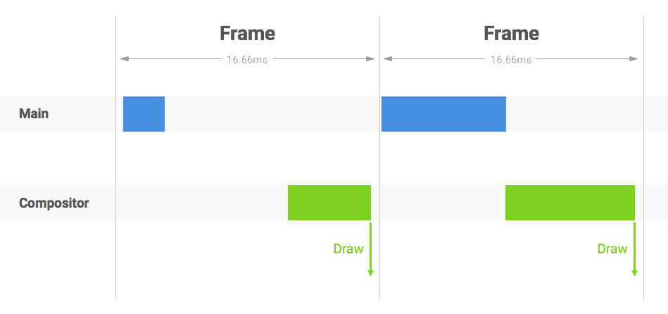

# 监控网页卡顿
https://fed.taobao.org/blog/taofed/do71ct/measuring-fps/?spm=taofed.homepage.header.7.7eab5ac8Zo8QVW


- 页面重绘前，浏览器会执行传入 requestAnimationFrame 的入参函数
- 一般多用来实现连贯的逐帧动画
- 可用来获取页面的绘制频率

```
var lastTime = performance.now();
var frame = 0;
var loop = function (time) {
	var now = performance.now();
	frame++
	var timeDelta = now - lastTime
	if(timeDelta >= 1000) {
		// 总帧数 / 1000毫秒，每秒绘制的帧数
		var fps = frame *(timeDelta/1000)
		console.log('fps:', fps)
		frame = 0
		lastTime = performance.now()
	}
	window.requestAnimationFrame(loop)
}
loop()

```

```
var lastFrameTime = performance.now()
var loop = function () {
	// 每帧耗费的时间
	var frameCost = performance.now() - lastFrameTime
	// 一秒能绘制的帧数。
	var fps = 1000 / frameCost
	console.log('fps', fps)
	lastFrameTime = performance.now()
	window.requestAnimationFrame(loop)
}
loop()
```

## 扩展阅读
### 渲染页面时涉及的2个线程
- render主线程和compositor合成线程
- 2个线程通过Commit消息来保持同步
### 每个frame的耗时组成
- 典型状态：每一帧消耗的时间应该包含render和compositor2个线程消耗的时间

- 对于CSS动画，无需通知主线程；滚动事件则是先转移给合成线程再通知主线程

- 一旦主线程耗时较多，导致提交给合成线程的时间推迟到了下一帧


### 总结
- 对于滚动和 CSS 动画
	- 由于不涉及主线程的影响，我们会更关心合成线程的绘制频率，而合成线程的绘制频率也反映了滚动和 CSS 动画的流程性。
- 对于 JS 帧动画而言
	- 我们期望主线程和合成线程的消耗加起来到能在 16.66ms 内，且不丢帧。因此我们需要同时关注主线程的 Commit 频率和合成线程的绘制频率，并且我们期望每个主线程的 Commit 都对应唯一一个合成线程的绘制（保证不丢帧）。

### Frame Timing
是否有方法可以让我们分别取到 Render 主线程和 Compositor 合成线程的数据呢?

Frame Timing API 目前还只是草案，暂时还没发现有浏览器支持

```
var rendererEvents = window.performance.getEntriesByType("renderer");
var compositeEvents = window.performance.getEntriesByType("composite");
```