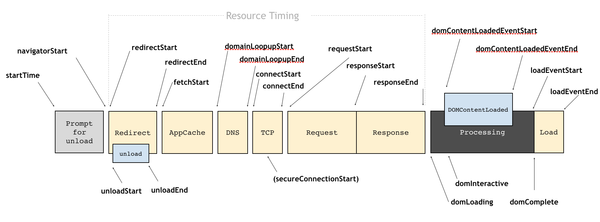
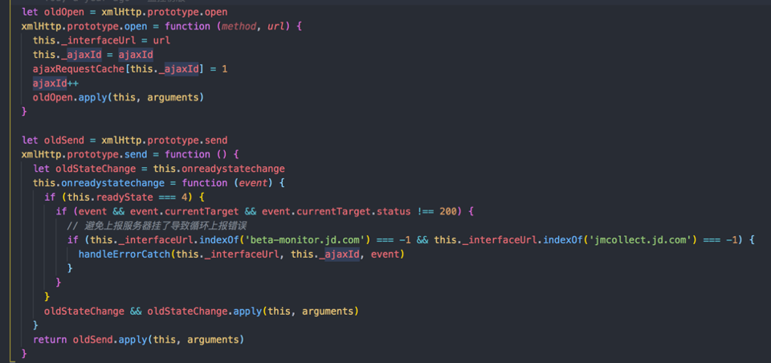
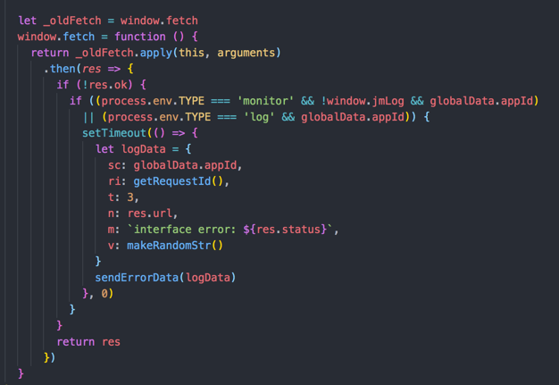

# 页面监控
## 性能数据
- 白屏时间：performance.getEntriesByType('navigation')[0].responseStart
- 可操作时间：performance.getEntriesByType('navigation')[0].responseStart
- 整页加载：performance.getEntriesByType('navigation')[0].loadEventEnd

## 异常监控
- 资源加载异常：JS、CSS、图片404 
	- window.addEventListener('error')
- JS执行异常
	- window.onerror(message, url, lineNo, colNo, error)
- Promise
	- window.addEventListener('unhandlerejection')
- ajax/fetch请求异常
	- AOP切面，对原有方法进行拦截
	- 比如重写了原方法

## 前端性能分析工具
- 分析维度：时间和空间
- 2种主要方式：合成监控（Synthetic Monitoring, SYN))、真实用户监控（Real User Monitoring, RUM）

### 合成监控 
- Lighthouse
	- 特性：在一个模拟场景中，提交一个页面，通过一系列工具、规则去运行页面，得到一个审计报告
	- 使用场景：开发和测试过程
	- 优点：
		- 可采集丰富的数据指标（通过结合Chrome Debugging Protocol）
		- 成熟的解决方案和工具，实现成本低
		- 不影响真实用户的性能体验
		
### 真实用户监控
- 借助Performance Timeline API，进行打点、计算、采集、上报。将数据发送到服务端，再对数据进行 处理、可视化
- 优点：
	- 完全还原真实场景，减去模拟成本
	- 数据样本大，可抹去个体差异 
	
## Chrome的Performance面板
- 主要功能：
	- FPS图表：红色条形，表示帧率下降太低，可能损伤用户体验。绿色则表示FPS高
	- CPU图表
	- 火焰图：横轴是时间，纵轴是调用指针，调用栈最顶端的函数在最下方
	- Bottom-up：看到对性能影响大的函数，并检查调用路径 

## Chrome DevTools Protocl
- 该协议基于WebSocket，基于websocket建立DevTools和浏览器内核的连接
- 功能模块
	- DOM
	- Debugger
	- Network
	- Console
	- Performance
- 基于该协议，我们可以
	- 获取JS的Runtime数据，比如常用的window.performance
	- 获取Network及Performance数据，进行自动性能分析
	- Puppeteer的CDPSeesion，与浏览器的协议通信会变得更简单  
