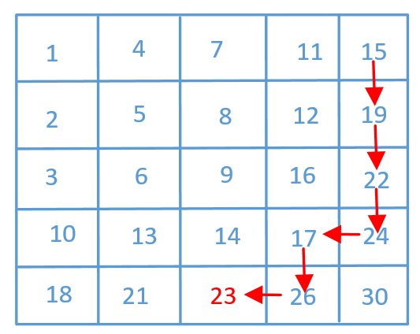

# 二维数组中的查找
在一个 n * m 的二维数组中，每一行都按照从左到右递增的顺序排序，每一列都按照从上到下递增的顺序排序。请完成一个函数，输入这样的一个二维数组和一个整数，判断数组中是否含有该整数。

 

示例:

现有矩阵 matrix 如下：

[
  [1,   4,  7, 11, 15],
  [2,   5,  8, 12, 19],
  [3,   6,  9, 16, 22],
  [10, 13, 14, 17, 24],
  [18, 21, 23, 26, 30]
]
给定 target = 5，返回 true。

给定 target = 20，返回 false。

 

限制：

0 <= n <= 1000

0 <= m <= 1000

# 解题思路
从右上或左下，保证在x、y两个方向上，一个最大一个最小。在路径选择的时候，就不会对下一步的行进方向无法作出判断

