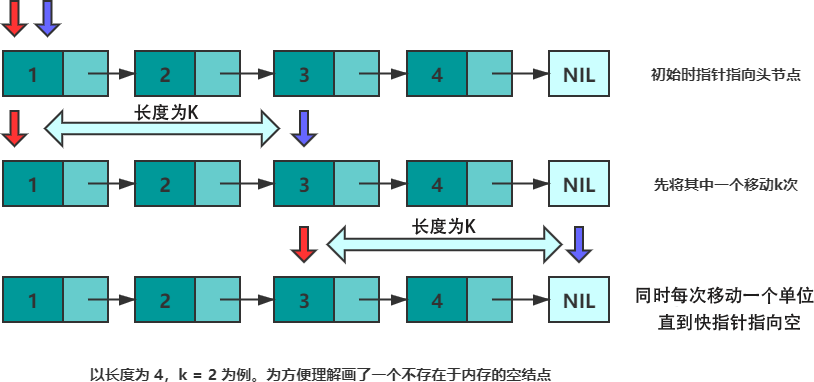

# 双指针：
## 线性表：数组与链表
### 1、数组
- 存储特点
	- 连续存储在连续内存
	- 每个元素占用的内存大小相同
- 优点
	- 快速访问 
- 缺点
	- 增删元素的成本很高O(n)
	- 扩容成本很高 
	
### 2、链表
- 存储特点
	- 由若干结点组成
	- 每个结点包含数据域和指针域 
		- 指针域：存储结点的内存地址

## 常见问题
### 1、倒数第K个元素问题
- 指针设定：
	- 初始时：慢指针指向头结点（第1个节点），快指针指向头结点往后的第K个节点，即K+1
	- 移动时：两个指针同时移动一个单位
- 确定条件：
	- 直到快指针指向空
	- 此时慢指针指向的就是倒数第K个元素 


```
class Solution {
public:
    ListNode* getKthFromEnd(ListNode* head, int k) {
        ListNode *p = head, *q = head; //初始化
        while(k--) {   //将 p指针移动 k 次
            p = p->next;
        }
        while(p != nullptr) {//同时移动，直到 p == nullptr
            p = p->next;
            q = q->next;
        }
        return q;
    }
};

```
### 2、获取中间元素
- 指针设定：
	- 初始时：都指向头结点
	- 移动时，慢指针移动一步，快指针连续移动两步
- 确定条件：
	- 快指针的next指向空 


```
class Solution {
public:
    ListNode* middleNode(ListNode* head) {
        ListNode *p = head, *q = head;
        while(q != nullptr && q->next != nullptr) {
            p = p->next;
            q = q->next->next;
        }
        return p;
    } 
};

```

### 3、是否有环 及求环的长度 
- 指针设定：
	- 初始时：都指向头结点
	- 移动时，慢指针移动一步，快指针连续移动两步
- 确定条件
	- 慢指针结点值等于快指针结点值
	


```
class Solution {
public:
    bool hasCycle(ListNode *head) {
        ListNode *slow = head;
        ListNode *fast = head;
        while(fast != nullptr) {
            fast = fast->next;
            if(fast != nullptr) {
                fast = fast->next;
            }
            if(fast == slow) {
                return true;
            }
            slow = slow->next;
        }
        return nullptr;
    }
};

```

#### 4、求链表的交点


```
var getIntersectionNode = function(headA, headB) {
    var pA = headA
    var pB = headB
    if(!headA || !headB) { return null}
    while(pA !== pB) {
        if(!pA.next && !pB.next) {
            return null
        }
        pA = !pA.next ? headB :  pA.next
        pB = !pB.next ? headA :  pB.next
        
    }
    return pA
};
```

 