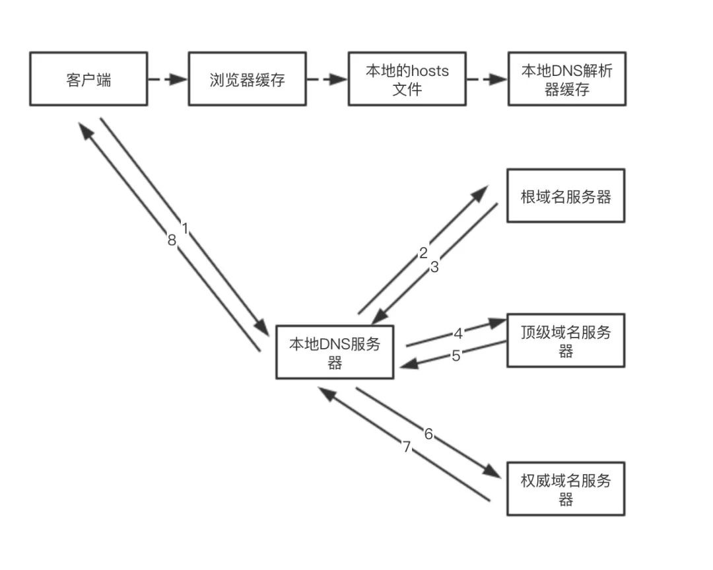
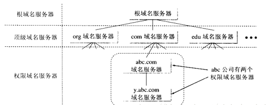

# DNS解析过程
## 本地dns查询
- 客户端
- 浏览器缓存
- 本地的hosts文件
- 本地DNS解析器缓存 
	
## 本地DNS服务器与根域及其子域之间
- 本地DNS服务器访问根域名服务器
- 访问顶级域名服务器
- 访问权威域名服务器

 

## 什么是本地DNS服务器
- 这类服务器不属于上面的层次结构
- 当一个主机(个人电脑)发出DNS请求时，查询请求就被发送到本地域名服务器，
	- 有缓存就读缓存
	- 无缓存，将代替主机向域名空间中不同层次的权威域名服务器查询，再把查询的结果返回给主机。

# DNS的缓存
共7个

- 本机的：有2个
	- 浏览器缓存 
	- 系统缓存
- 本机到网络之间：有2个
	- 路由器缓存
	- ISP缓存
- 网络DNS系统：有3个
	- 根域名服务器缓存
	- 顶级域名服务器缓存
	- 权威域名服务器缓存