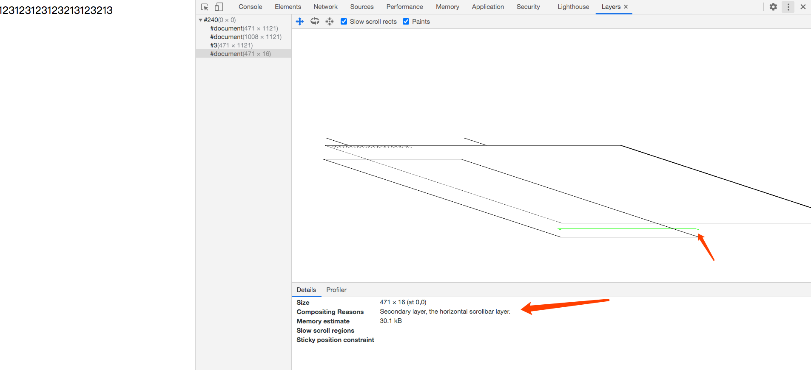

# 浏览器渲染
## 总览
主要分成以下个步骤

- 构建dom树
- 样式解析
- 构建布局树
- 构建分层树
- 栅格化
- 绘制

## 1、构建dom树
- 将HTML的原始字节数据转成字符串
- token化
- 创建node节点：添加特定的属性，包括：关系节点（指向父节点、子节点、兄弟节点）还有所属的treeScope
- 构建dom树：处理node节点之间的父子、兄弟关系

## 2、样式解析
- 样式属性值的标准化处理：color: blue、2em、font-weight: bold，转成浏览器易识别的值。
- 样式的继承与层叠处理

## 3、构建布局树（Render Object Tree）
- 排除script、meta等非可视的节点
- 排除display：none的节点
- 计算出节点的布局信息：宽高、位置

## 4、构建图层树
- 针对一些特殊的样式，zIndex、3D 变换、页面滚动，浏览器需为这些节点创建专用的图层。最终得到一棵图层树。
- 如果一个节点没有新建图层，则从属于父级节点的图层

## 5、栅格化
- 渲染引擎实现图层的绘制：把一个图层拆分成很多小的绘制指令，再把这些指令按照顺序组成一个待绘制列表。
- 主线程把绘制列表交给 合成线程
- 合成线程将图层个划分成图块，优先将视口附近的图块生成位图（优先绘制视口可见的图块）
- 将图块转化成位图的过程，叫做栅格化

## 6、绘制
一旦所有图块被光栅化

- 合成线程发出绘制图块的命令给浏览器进程
- 浏览器根据指令生成页面，并显示到显示器

# 回流和重绘
- 回流：几何尺寸变化。比如修改元素的宽高、隐藏等
	- width、height、padding、margi、left、top、border 
	- 获取一些需要通过【即时计算】得到的属性：offsetTop、offsetLeft、scrollWidth、getComputedStyle
- 重绘：样式改变，几何属性不变
- 优化点：
	- 避免逐条改变样式：使用类名合并样式
	- DOM离线，DocumentFragment
	- 提升为合成层，如使用will-change
		- 合成层的位图，交由GPU处理，比CPU快
		- repaint时：不会影响其他的层
		- 对于transform和opacity：不会触发layout和paint

- flush队列：存储回流和重回任务
- 批量执行队列里的操作  

# 渲染引擎何时会为特定的节点创建新的图层
- 根元素（HTML）
- will-change：指定了css属性
- scrollbar
- position：fixed/sticky（sticky定位适配所有移动设备上的浏览器，但老的桌面浏览器不支持）
- opacity：值小于1
- transform：不为none的元素
- zIndex
	- zIndex值不为“auto”的 *绝对/相对*定位元素
	- zIndex值不为“auto”的flex子项（即父元素display:flex|inline-flex）
	- zIndex值不为“auto”的grid子项（即父元素display:grid）
- filter：值不为normal
- mask/mask-image/mask-border不为none的元素
- clip-path：不为none

	

