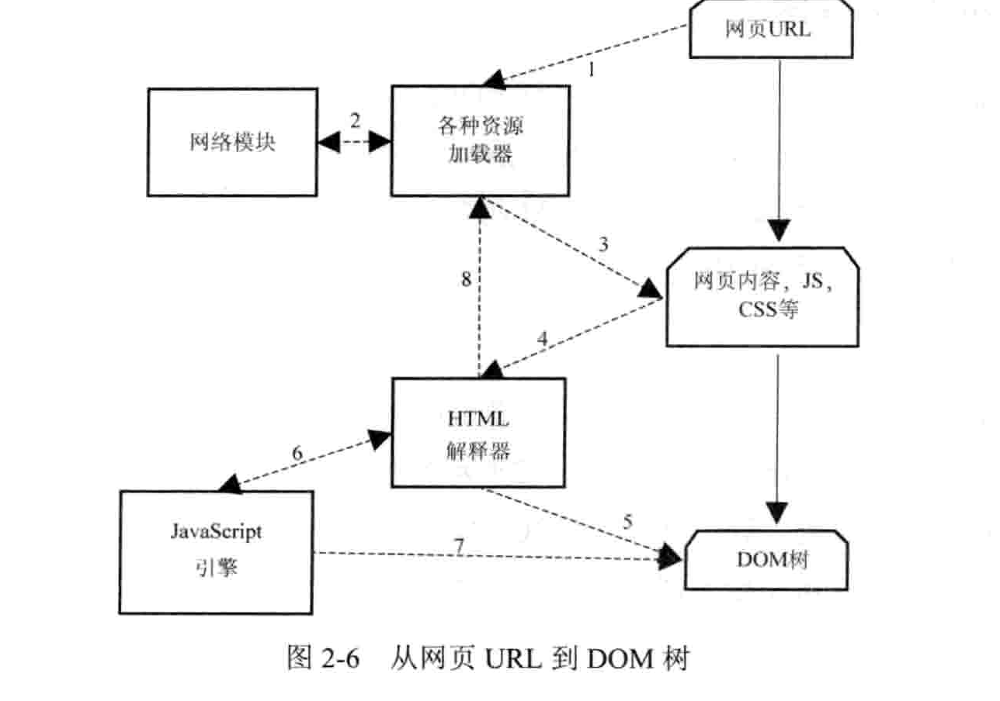
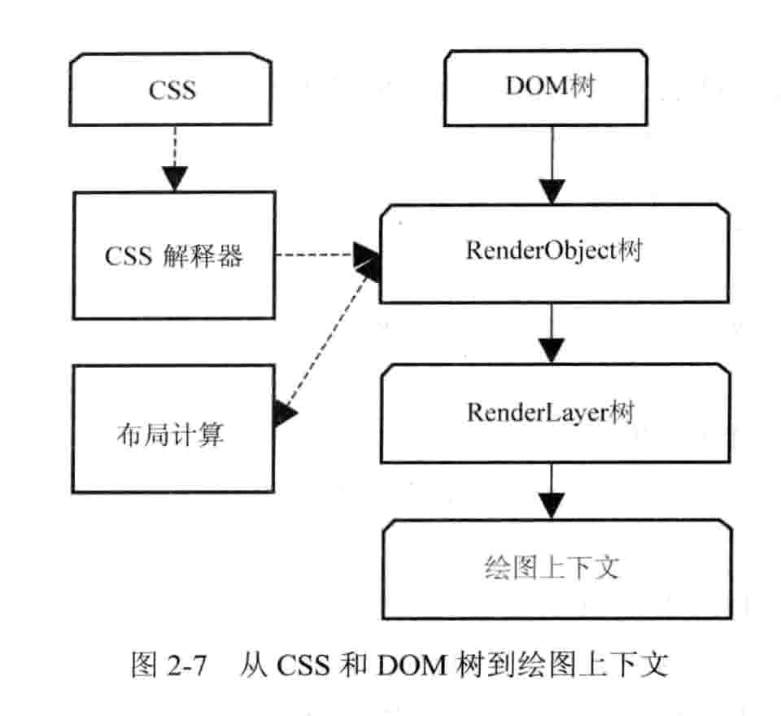
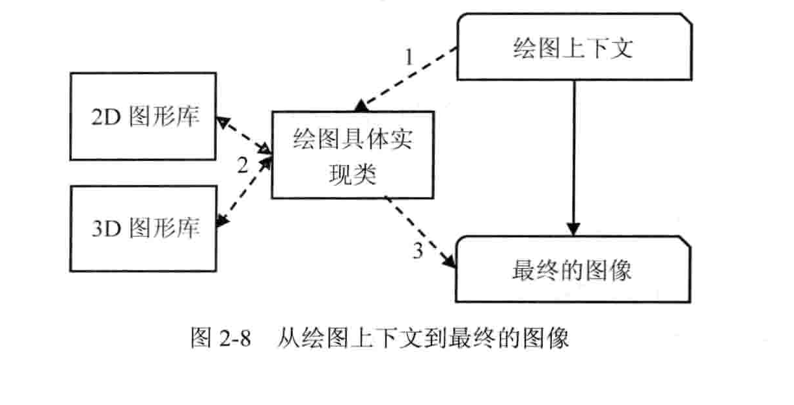
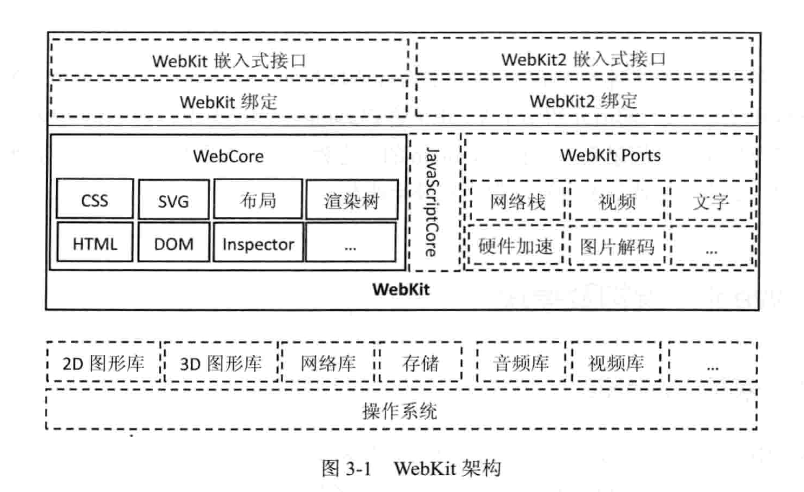
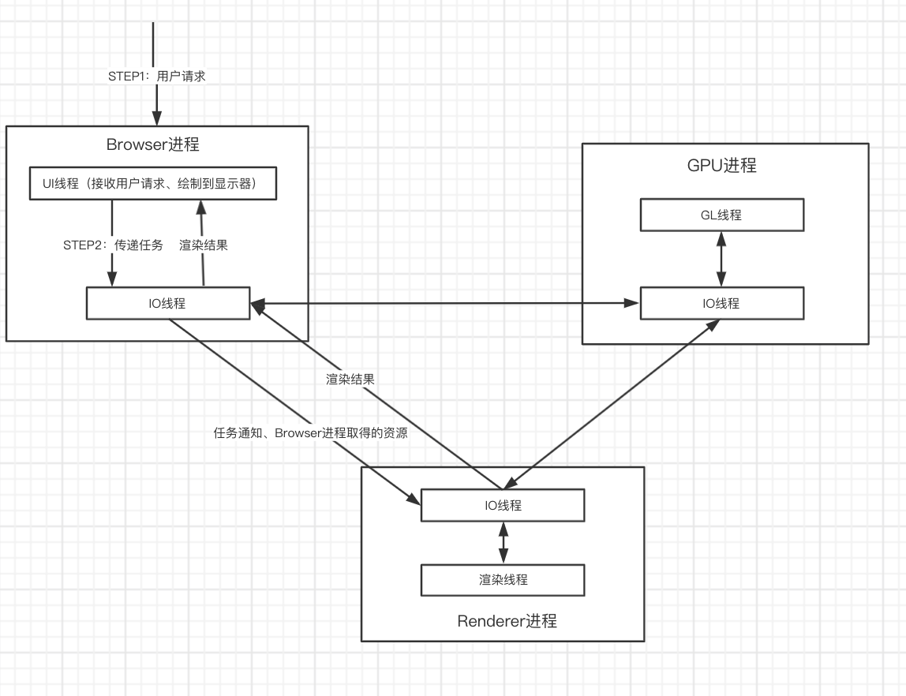

# 第二章  HTML网页和结构
## 用户输入URL转变成可视化的图像
- 网页加载渲染过程： 从URL到构建DOM树，再从DOM树到生成可视化图像 
- 网页通常比屏幕可视面积大
- 根据数据流向，可将渲染过程分成三个阶段（如下图）
	- STEP1：从URL构建DOM树
	- STEP2：从DOM树到构建完Webkit的绘图上下文
	- STEP3：从绘图上下文到生成最终的图像
	
##STEP1 URL到构建完DOM树的详细过程

- Webkit调用 资源加载器 加载该URL对应的网页
- 加载器依赖网络模块 建立连接，发送请求并接收答复
- webkit接收到各种网页或者资源数据（可能是异步或同步）
- 网页被交给HTML解释器，转变成一系列的Token
- 解释器根据Token构建Node节点，形成DOM树
- 如果节点是Js代码，调用Js引擎解释并执行
- js代码可能会修改DOM树结构
- 如果节点依赖其他资源，例如图片、css、视频等，不会阻塞DOM树构建（但会阻碍STEP2和STEP3，图像绘制）；
	如果是js资源（未标记异步方式），则停止DOM树构建，待资源被加载和执行后才继续构建DOM树
	
## STEP2 从DOM树到构建绘图上下文

- CSS文件被CSS解释器解释成内部表示结构
- CSS解释器工作完之后，在DOM树上附加解释后的样式信息，这就是RenderObject树
- RenderObject节点在创建的同时，根据网页的**层次结构**创建RenderLayer树，同时构建一个虚拟的绘图上下文

## STEP3 从绘图上下文到最终的图像

- 绘图上下文是一个抽象类，具体绘图操作被桥接到不同的绘图具体实现类
- 绘图实现类将2D图形库或3D图形库绘制的结果保存下来，交给浏览器界面显示

# 第三章 Chromium浏览器架构

## 多进程架构
- Browser进程：浏览器的主进程，负责浏览器界面的显示、各个页面的管理，是所有其他类型进程的祖先，负责他们创建和销毁。
- Renderer进程：负责页面的渲染工作。Blink/Webkit的渲染工作主要在这个进程中完成。Renderer进程数量和用户打开的网页数量不一定一致。
- GPU进程：最多只有一个，当且仅当GPU硬件加速打开，主要用于对3D图形加速调用的实现
- - Napi、Pepper插件进程
- 其他类型进程

- 总结：Browser进程和页面的渲染是分开的，保证页面渲染不会导致浏览器主界面崩溃
- 每个网页是独立进程
- 插件进程也是独立的
- GPU硬件加速进程也是独立的
- 默认是每个tab一个进程，也可以通过配置来修改

## 多线程
- 每个进程内部有很多线程，为保证用户界面的高响应度。

# 第四章 资源加载和网络栈
- 资源是否阻塞 以及怎么办？

	一般来说，CSS/Img类型的资源的获取不会阻碍当前WebKit的渲染进程。
	- Javascript则会阻碍主线程的渲染过程
	- 解决办法：启动另外一个线程去遍历后面的HTML网页，并发地请求下载资源