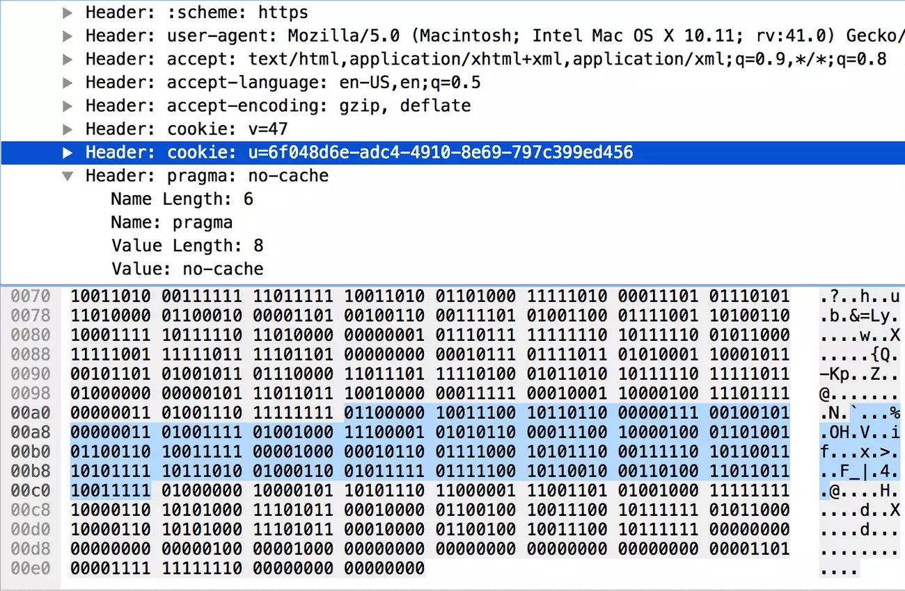

# HTTP2 首部压缩
## 头部压缩需要额外工作
- 维护静态字典：包含常见的头部名称、常见的头部名称与值的组合
	- 该字典需要内置在服务器和浏览器
	- 首次请求中就可以用到，用1个字符表示这个头部名称或键值对
- 维护动态字典：可以动态地添加内容
	- 上下文相关，每个连接都不同 
	- 需要通知对端有变更
	- 一个连接复用得越久，动态字典会不断的累积，首部压缩的效果会越好
- 支持哈夫曼编码：基于静态哈夫曼码表
	- 该表需要内置在服务器和浏览器

## 举例子


### 1、对于完全匹配的头部名称-头部值的情况
- 格式如下

```
 0   1   2   3   4   5   6   7
+---+---+---+---+---+---+---+---+
| 1 |        Index (7+)         |
+---+---------------------------+


7+（下文同理，如果出现了N+）意味着需要进行编码。
目的是为了让N位二进制可以表达更多的数值
比如对于7+，后面7位只能表达2^7 - 1 = 127
当大于127位的时候，会进行二次编码


PYTHONif I < 2 ^ N - 1, return I         # I 小于 2 ^ N - 1 时，直接返回
else
    M = 0
    repeat
        B = next octet             # 让 B 等于下一个八位
        I = I + (B & 127) * 2 ^ M  # I = I + (B 低七位 * 2 ^ M)
        M = M + 7
    while B & 128 == 128           # B 最高位 = 1 时继续，否则返回 I
    return I
```
- 用8个bit（1个字节）表示，首位固定为1
- 只用一个字节就能表示该`头部名称-头部值`
- 对于首部:method = GET
	- 查表之后可以用一个字符`2` 来表示，二进制为`0000010`
	- 最终表示为`10000010`
	
	

### 2、对于只有头部名称（键）匹配的情况
- 只有`头部名称`在字典里出现，比如cookie
- 格式如下

```
  0   1   2   3   4   5   6   7
+---+---+---+---+---+---+---+---+
| 0 | 1 |      Index (6+)       |
+---+---+-----------------------+
| H |     Value Length (7+)     |
+---+---------------------------+
| Value String (Length octets)  |
+-------------------------------+
```



- 第一行：用一个字节表示`头部名称`
	- 前两位是固定的01
	- 后6为是`头部名称`在字典里的代号
	- 对于cookie来说，则是32，即 01100000
	- 见图中蓝色二进制部分，第1组的8位bit（01100000）
- 第二行

	- 首位表示是否开启了哈夫曼编码，值为0或1
	- 后面的7位：`头部值`的长度（若编码了，则是编码后的长度，单位是字节）
	- 见图中蓝色二进制部分，第2组的8位bit （10011100）
		- 可见开启了哈夫曼编码（首位为1） 
		- 后7位0011100 表示`头部值`有28个字节
- 第三行
	-  `头部值`（如果有编码，那就是编码后的）
	-  图中第三组8位bit开始，共28组，即28个字节

- 首次需要添加到动态字典
	- 客户端或服务端看到这种格式的头部键值对，会将其添加到自己的动态字典中
	- 后续传输这样的内容，就能类似第 1 种情况了，直接用一个字符（8位）表示了 
	
### 3、对于头部名称（键）也不在静态字典里的情况
```
  0   1   2   3   4   5   6   7
+---+---+---+---+---+---+---+---+
| 0 | 1 |           0           |
+---+---+-----------------------+
| H |     Name Length (7+)      |
+---+---------------------------+
|  Name String (Length octets)  |
+---+---------------------------+
| H |     Value Length (7+)     |
+---+---------------------------+
| Value String (Length octets)  |
+-------------------------------+
```

- 由于头部都不在静态字典里，因此第一个字节是固定的0100000
- 接着申明`头部名称`是否使用哈夫曼编码及长度，并放上`头部名称`的具体内容
- 接着申明`头部值`是否使用哈夫曼编码及长度，并放上`头部值`的具体内容

- 同上面第二种情况：客户端或服务端看到这种格式的头部键值对，会将其添加到自己的动态字典中。后续传输这样的内容，就符合第 1 种情况了。

### 4、对于头部名称在静态字典里，但是不允许更新动态字典
```
  0   1   2   3   4   5   6   7
+---+---+---+---+---+---+---+---+
| 0 | 0 | 0 | 1 |  Index (4+)   |
+---+---+-----------------------+
| H |     Value Length (7+)     |
+---+---------------------------+
| Value String (Length octets)  |
+-------------------------------+
```
- 对于一些非常敏感的头部，比如用来认证的 Cookie，这么做可以提高安全性。
- 第一个字节左四位固定为 0001，只剩下四位来存放索引了，对于索引超过2^4 - 1 = 15的头部名称，要二次编码

#### 5、头部名称不在字典中，不允许更新动态字典
```
  0   1   2   3   4   5   6   7
+---+---+---+---+---+---+---+---+
| 0 | 0 | 0 | 1 |       0       |
+---+---+-----------------------+
| H |     Name Length (7+)      |
+---+---------------------------+
|  Name String (Length octets)  |
+---+---------------------------+
| H |     Value Length (7+)     |
+---+---------------------------+
| Value String (Length octets)  |
+-------------------------------+
```