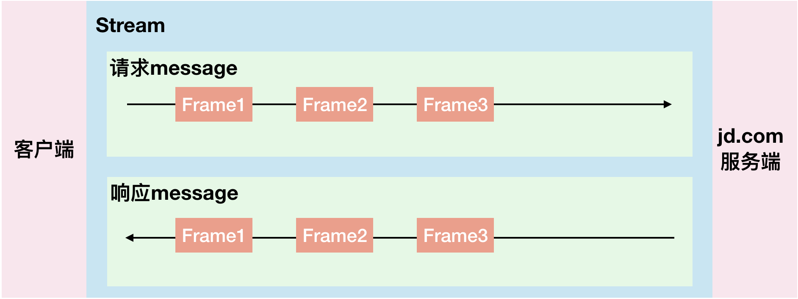

# HTTP2
https://blog.csdn.net/zdplife/article/details/81432017
## 数据流／消息／帧的区别
- 数据流：已建立的连接内的双向字节流，可以承载一条或多条消息。
- 消息：与逻辑请求或响应消息对应的完整的一系列帧。
- 帧：HTTP/2 通信的最小单位，每个帧都包含帧头，至少也会标识出当前帧所属的数据流。

- 所有通信都在一个 TCP 连接上完成，此连接可以承载任意数量的双向数据流。
- 每个数据流都有一个唯一的标识符和可选的优先级信息，用于承载双向消息。
- 每条消息都是一条逻辑 HTTP 消息（例如请求或响应），包含一个或多个帧。
- 帧是最小的通信单位，承载着特定类型的数据，例如 HTTP 标头、消息负载，等等。 来自不同数据流的帧可以交错发送，然后再根据每个帧头的数据流标识符重新组装。
- 数据流依赖关系和权重的组合明确表达了资源优先级，这是一种用于提升浏览性能的关键功能，网络中拥有多种资源类型，它们的依赖关系和权重各不相同。不仅如此，HTTP/2 协议还允许客户端随时更新这些优先级，进一步优化了浏览器性能

## 重要特性
- 二进制协议
- 每个域一个tcp连接（HTTP1.x是每个文件一个连接）
- 首部使用特制的HPACK压缩（非SPDY中使用gzip打包）
- 优先级排定规则
- 大部分的实现都强制开启了HTTPS

## 一些缺点
- 单连接开销大
	- HPACK数据压缩算法，需要维护两端的查找表
- 你的应用可能不需要SSL的保护
- 需要抛弃一些对HTTP1.X的优化
	- 它们可能会影响HTTP2下的性能
- 对下载大文件不利
	- 大文件或流媒体播放，可能不需要TLS
	- 只有一个流的情况下，多路复用也体现不出什么优势   

## HTTP1.X的优化反而在http2中会使性能降低
HTTP1.X中的常见优化

- 分域名存储：为了实现并行请求文件
	- 建议：使用HTTP2友好的分域存储：
		- 让多个域名解析到同一个IP。
		- 确保证书包含通配符，以便所有分域名都可以使用，适当的多域证书当然也可以。 
	- 结果：
		- 分域对HTTP/1.x有效：即域名仍然可以触发浏览器创建更多连接
		- 对HTTP/2则无效：因为这些域名会被看成同一个ip地址，一个连接即可访问所有域名