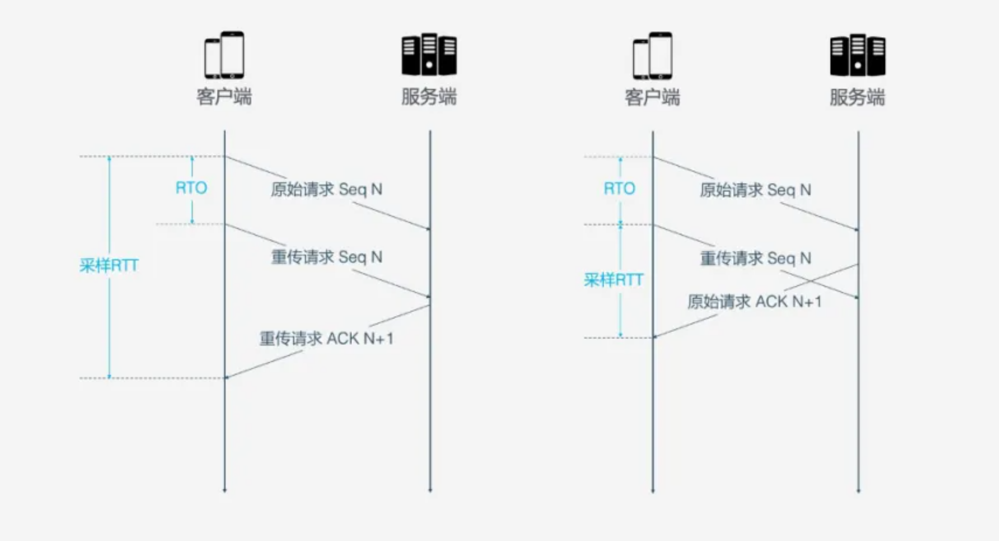

# 各环节可能出现的队头阻塞
### HTTPS:
- TLS 基于 Record 组织数据，
- 将一堆数据放在一起（即一个 Record）加密
- 加密完后又拆分成多个 TCP 包传输。
- 一般每个 Record 16K，包含 12 个 TCP 包，这样如果 12 个 TCP 包中有任何一个包丢失，那么整个 Record 都无法解密。

### HTTP1.X 请求粒度的阻塞：
前一个请求没有处理完，后面的请求无法被处理（在缓冲区）
### HTTP2.0 多路复用 tcp粒度的阻塞：
- 一条连接能同时发送多个请求
- frame：请求被拆分成多个frame
- stream：不通过请求的frame，组合成stream。stream是TCP的逻辑传输单元（做多了同时传输多个请求里的某些部分）

# HTTP3
## 概览：
- HTTP3基于QUIC：
	- QUIC是传输层协议，用来替代TCP、SSL/TLS
	
## 特性
### 1、零RTT建立连接
- 从请求连接到正式接发HTTP数据一共花了1RTT：主要是为了获取Server Config
- 如果缓存了Server Config，将实现0 RTT

### 2、连接迁移
- 存在的问题：
	- tcp连接基于四元组，切换网络时至少有一个因素发生变化导致连接发生变化。建立新的连接需要几百毫秒，甚至需要等待老的连接超时后，才建立
- 解决思路：
	- 四元组变化时，连接依然维持着
	- 不以四元组作为标识，而是使用一个64位随机数 -- Connection ID
	
### 3、队头阻塞/多路复用
-  存在的问题
	- TCP面向连接，每次发送请求都要收到ACK
	- HTTP1.1：pipeling支持以恶搞连接同时发送多个请求 ，但是依然要等待前面的请求被处理完，才能处理下一个
	- HTTP2：多路复用解决了上面的对头阻塞问题：将请求拆成功多个Frame在tcp连接上同时传输 
	- HTTP2：只解决了“请求”这个粒度的阻塞，但是TCP协议本身会存在队头阻塞
	- HTTP2必须使用HTTPS：TLS也存在对头阻塞
- 解决思路
	- 基于UDP，在接收端没有处理顺序；
		- 即使包丢失，也不会阻塞整条连接
		- Packet是传输单元也是加密单元，可避免TLS队头阻塞 
		
### 4、拥塞控制
#### 热插拔
- 作用范围：如何修改*拥塞控制策略*
- TCP：需要在系统层面进行操作
- QUIC：需要在应用层操作，并且会根据网络环境、用户，来动态选择拥塞控制算法

#### 前向纠错FEC
- 作用范围：减少丢包和重传，但是适当增加了数据冗余
- QUIC：
	- 对数据包进行异或运算，作为FEC包，与数据包被传输
	- 一旦某个数据包丢失，可用FEC包推算出原始包
	
#### 单调递增的Packet Number
- 作用范围：
	- TCP为了保证可靠性，使用Sequence Number 和 ACK来确认消息是否有序到达。
	- 因为原始请求和重传请求接收到的 ACK 消息一样，所以客户端无法区分该ACK 对应的是原始请求还是重传请求。
	
	

	- 如果客户端认为是原始请求的 ACK，但实际上是左图的情形，则计算的采样 RTT 偏大；
	- 如果客户端认为是重传请求的 ACK，但实际上是右图的情形，又会导致采样 RTT 偏小。
	- 图中有几个术语，RTO 是指超时重传时间（Retransmission TimeOut），跟我们熟悉的 RTT（Round Trip Time，往返时间）很长得很像。采样 RTT 会影响 RTO 计算，超时时间的准确把握很重要，长了短了都不合适。
- QUIC：
	- 如果 Packet N 丢失了，那么重传时 发送出去的Packet 的标识不会是 N，而是比 N 大的数字
	
#### ACK Delay
- 作用范围：计算RTT（何时需要RTT？）
- TCP：没有考虑【接收方接收到数据】到【发送确认消息】之间的延迟（可能是接收方的一些内部处理耗时）

#### 更多的ACK块
- 作用范围：接收方收到发送方的消息后都应该发送一个ACK回复
- TCP： 最早的是一个回复一个ACK；后来有SACK（累加满3个数据包，就发送一个ACK）
- QUIC：最多可以捎带256个ACK block（在丢包率比较严重的网络下可以大大减少重传量）

### 5、流量控制
- 前言：
	- 流量控制：防止接收方处理不过来数据
	- 拥塞控制：防止发送方向网络中发送过多数据
- QUIC的流量控制分为个维度
	- 连接 = 一条公路，stream等于这条公路上的货车 
	- 连接级别控制：避免公路上太多货车
		- 接收窗口 = Stream1接收窗口 + Stream2接收窗口 + ... + StreamN接收窗口 。
	- stream级别：避免货车超载
		- 接收窗口(flow control receive window) = 最大接收窗口(max receive window) - 已接收数据(highest received byte offset)  