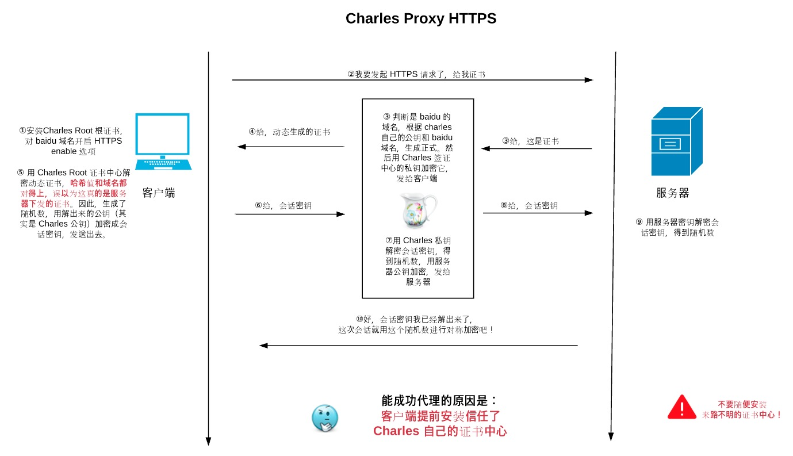
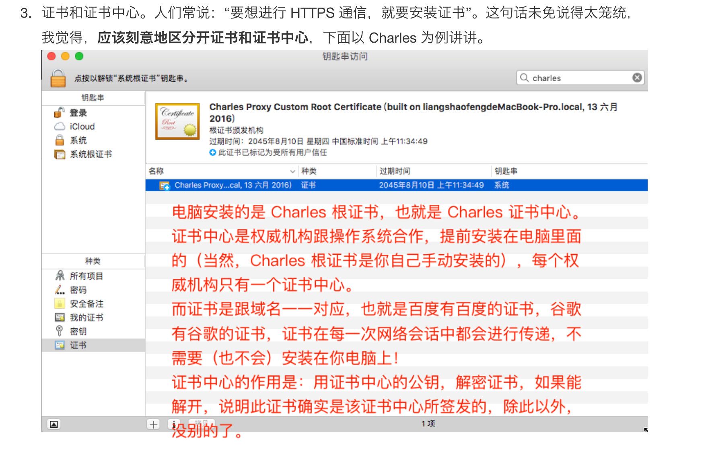
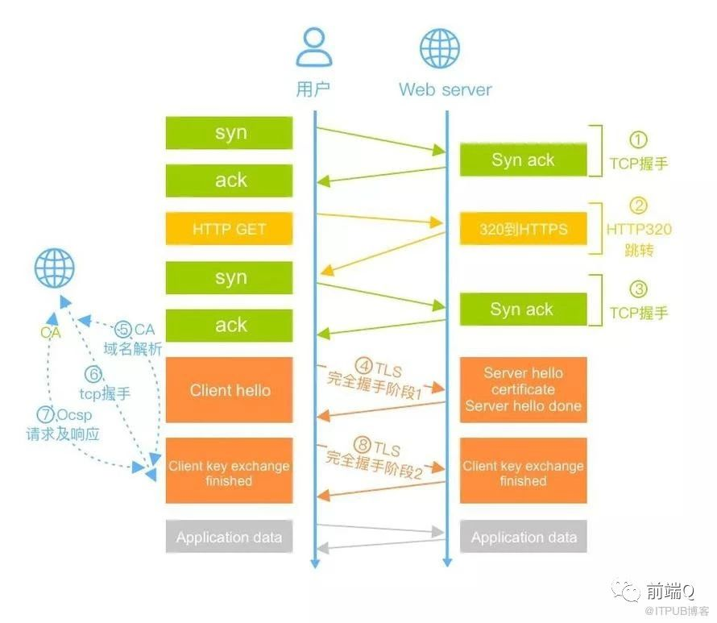

## 主要作用
- 建立信息安全通道，确认网站的真实性

## 主要特点
- 内容加密：中间者无法直接查看原始内容
- 数据完整性：防止内容被第三方冒充或篡改
- 身份认证：即使被DNS劫持到了第三方站点，也会提醒用户访问的不是目标服务器，可能被劫持了

## HTTPS和HTTP的区别
- 协议类型不同
	- http：明文协议，超文本传输协议
	- https：加密协议，ssl加密传输协议
- 端口不同
	- http:80; https:443 
- https需要ca证书
- http连接是无状态的
- https协议是由SSL+HTTP协议构建的可进行加密传输、身份认证的网络协议

## 四次握手
#### 第1次握手
* 客户端向服务器发送一个随机数clientKey
* 客户端发送 SSL协议版本 
* 客户端发送 可选的加密算法
* 客户端发送 可选的压缩算法

#### 第2次握手
* 服务端向客户端发送 随机数server key
* 服务端向客户端发送 选择的压缩算法
* 服务端向客户端发送 选择的加密算法
* 服务端发送数字证书(包含公钥)

#### 第3次握手
* 前置操作： 判断服务端的证书是否合法
* 客户端发送第三个随机数premaster key
* 使用3个key来生成会话用的对称密钥。
* 客户端通知编码变更：接下来会话都会加密。
* 客户端发送握手结束通知（一条前面所有内容的hash值，供服务端校验）
    
#### 第4次握手
* 服务端接收到加密后的premaster key, 用私钥解密，用三个key计算出会话用的对称密钥。
* 通知编码变更
* 通知握手结束
* 发送hash值


#### 小结
SessionKey 作为对称密钥，用于加密通信内容； 非对称加密则用于加密premasterKey。
在某些文章当中，会直接将3个key简述成只有一个。但是原理基本都类似：

- 1. 通信双方使用对称密钥加密通信内容。
- 2. 对称密钥由客户端产生，并发送给服务端。
- 3. 对称密钥发送的过程中，使用服务端发出的公钥加密；服务端接收到加密后的对称密钥，使用私钥解密，得到对称密钥。
- 4. 非对称加密只用于握手阶段（即用在 `传递客户端产生的对称密钥` 过程中）。非对称加密只能保证单向传输的安全性，需要对称加密保证后续双方的双向通信安全。

## 中间人攻击和https的应对措施
### 现象
- 发生的时机：在服务器返回公钥的时候，中间人介入，给客户端返回了自己的证书（和公钥）。
- 问题产生的原因：客户端无法校验*证书（和公钥）*是否真的来自服务器

### 应对措施
- 数字证书：服务器产生的证书，需要CA机构（比如叫做机构A）认证。返回给客户端已认证的证书
	- 认证过程：CA针对证书内容（一般含有公钥和域名）生成hash，用自己的私钥加密
- 客户端：
	- 安装了多个CA机构的根证书（证书中心）
	- 接收到服务器证书的时候，找到对应CA机构的私钥，解密证书hash。校验hash值、域名
	
### 如何验证过证书的合法性
- 验证证书来源：用本地内置操作系统和浏览器的根证书来验证
- 验证证书是否已吊销：OCSP在线证书状态协议
	
### 数字证书和数字签名的区别
- 数字签名一般是**发送数据的服务端**产生的，用**自己的私钥**加密【内容hash】，用于验证数据完整性
- 数字证书一般是CA机构产生的，用**CA自己的私钥**加密证书里的内容。用于身份认证，确保证书(和公钥）一定是目标服务器的，数据里的签名一定是目标服务器签的。
	
## “安装证书”的错误迷思
- 证书一般是在握手阶段网络传递的
- 一般我们不需要安装证书，真正安装的是根证书，也就是证书中心。
- 根证书是怎么被安装的？权威机构跟操作系统合作，内置在电脑里的。

## Charles怎么做到“中间人攻击”的
- 如何做到成功代理的？
	- 关键是：客户端提前安装了信任Charles自己的根证书
	- 根据【自己的公钥、baidu域名】生成hash值，用自己的私钥加密，返回给客户端
	- charles和服务端进行通信
- ！不要随意安装过来路不明的证书中心（根证书）




## https网络访问过程


- STEP1：前置的跳转
	- 三次握手建立 TCP 连接。耗时一个 RTT。
	- 使用 HTTP 发起 GET 请求，服务端返回 302 跳转到 https://www.baidu.com 。需要一个 RTT 以及 302 跳转延时。
	- 三次握手重新建立 TCP 连接。耗时一个 RTT。
- STEP2：确认协议版本、加密算法、交换clientKey和serverKey
	- TLS 完全握手阶段一。耗时至少一个 RTT。
- STEP3：验证证书有效性：
	- 解析 CA 站点的 DNS。耗时一个 RTT。
	- 三次握手建立 CA 站点的 TCP 连接。耗时一个 RTT。
	- 发起 OCSP 请求，获取响应。耗时一个 RTT。
	
	备注：OCSP即在线证书状态协议（OCSP，Online Certificate Status Protocol）

- STEP4：使用证书公钥，发送premasterkey
	- 完全握手阶段二，耗时一个 RTT 及计算时间。
- STEP5：完全握手结束后，浏览器和服务器之间进行应用层（也就是 HTTP）数据传输。

需要增加7个RTT，只有少数请求会经历以上步骤 

```
它们需要满足如下条件：

必须是首次请求。即建立TCP连接后发起的第一个请求，该连接上的后续请求都不需要再发生上述行为。

必须要发生完全握手，而正常情况下80%的请求能实现简化握手。

浏览器需要开启OCSP或者CRL功能。Chrome默认关闭了OCSP功能，Firefox和IE都默认开启。

浏览器没有命中OCSP缓存。OCSP一般的更新周期是7天，Firefox的查询周期也是7天，也就说是7天中才会发生一次OCSP的查询。

浏览器没有命中CA站点的DNS缓存。只有没命中DNS缓存的情况下才会解析CA的DNS。
```

## https速度优化
### 访问速度优化
- 设置HSTS
	- 动机：避免http请求跳转到https，将耗费多一次RTT
	- 机制：服务端返回一个HSTS的http header，浏览器获取到HSTS头部之后，都会在内部将请求跳转成https协议
- 使用SPDY或者http2:
	- 动机：解决队头阻塞
	- 机制：依赖于http2的多路复用，将多个 HTTP 请求在同一个连接上一起发出去
- Nginx设置Ocsp stapling:
	- 动机：客户端需要主动查询CA证书的可靠性，不如让服务器自行查询之后，将OCSP信息随证书链一同返回
	- 机制：依赖于OCSP响应的不可伪造特性，不会产生额外的安全问题
- False start：
	- 动机：请求捎带 
	- 机制：clientkeyexchange 发出时将应用层数据一起发出来，类似于tcp的请求捎带 
- Session resume
	- 动机：复用，节省RTT和计算耗时
	- 机制：复用session，减少CPU消耗，不再进行非对称密钥交换的计算。不需要进行完全握手阶段二
		- session cache、 session ticket 
### 计算性能优化
- 优先使用ECC椭圆加密算法
- 使用最新版的openssl
- 硬件加速方案
- TLS远程代理计算


参考文章：http://www.alloyteam.com/2019/07/13821/


