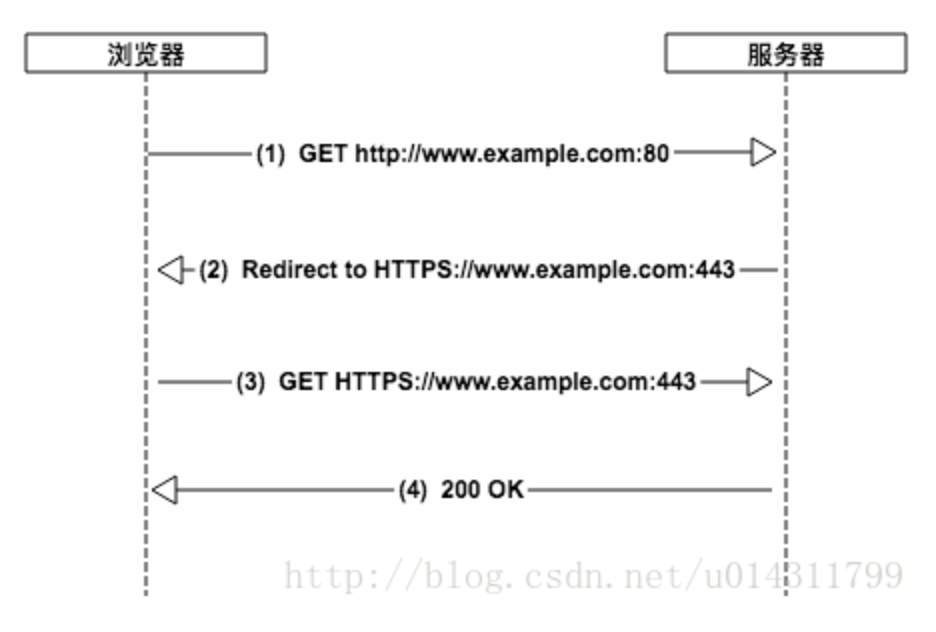
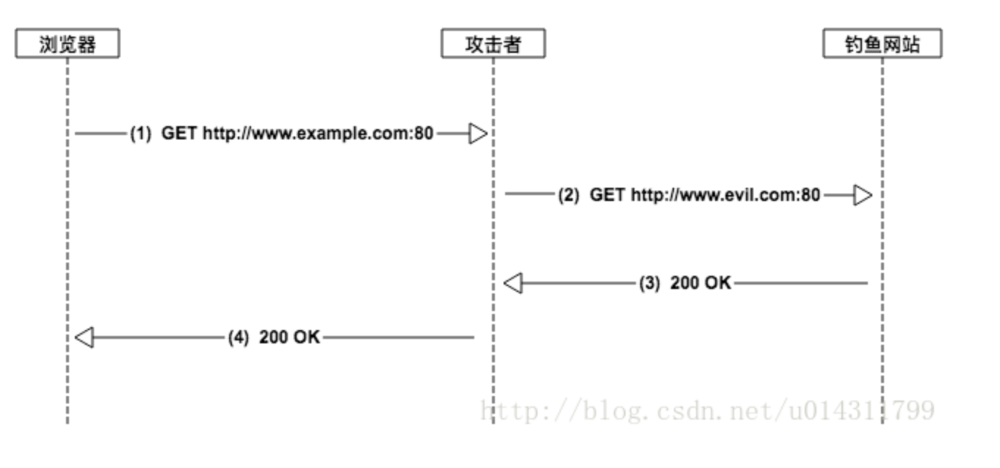
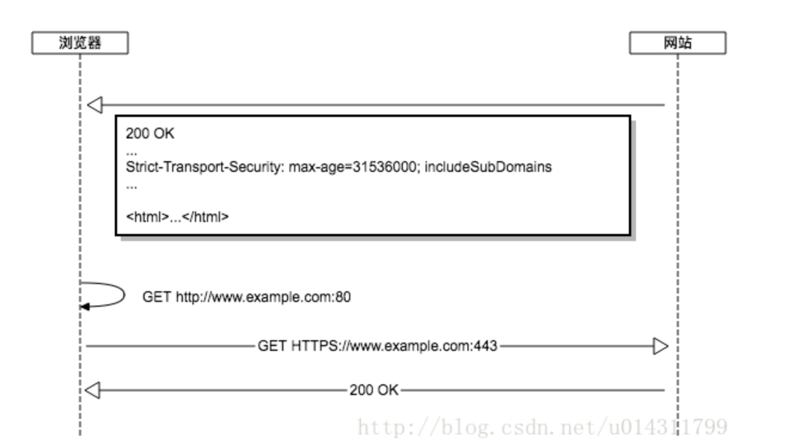

# 重定向
## 301 Moved Permanently 永久重定向
Location字段中指出新的地址

- HEAD和GET以外的请求，比如post，如果收到了301状态码，需经过用户确认之后才能重定向
- 搜索引擎会抓取新内容，并保存新的网址

## 302 Moved Temporarily
Location字段中指出新的地址

- 302表示旧地址A的资源还在（仍然可以访问），这个重定向只是临时地从旧地址A跳转到地址B
- 搜索引擎会抓取新的内容而保存旧的网址。

## 304 Not Modified

## 307 Temporary Redirect
在这种情况下，请求应该与另一个URI重复，但后续的请求应仍使用原始的URI。

- 场景：常见于HSTS
- 什么是HSTS
	- HTTP 严格安全传输协议（HTTP Strict Transport Security）
	- 现象：网站可以使用这个策略，来让浏览器强制使用HTTPS访问该网站
- 注意：307是由浏览器返回的，并不是服务器
- 机制：
	- 首次访问时，服务器返回头部
	
	```
		Strict-Transport-Security: max-age=31536000; includeSubDomains; preload;
	``` 
	
	- 常见参数
		- max-age：表明在这段时间范围内，强制使用HTTPS访问
		- includeSubDomains：该网站的子域名也必须通过 HTTPS 协议来访问
		- preload：可选参数，预加载到浏览器缓存
			- 只有当你申请将自己的域名加入到浏览器内置列表的时候才需要使用到它
			- 一般来说，HSTS都要在第二次访问时才起作用 
			- 如何第一次访问时也能强制使用HTTPS？
				浏览器官方会维护一个列表，记录想要开启HSTS的网站的域名。这个列表是内置在浏览器代码里的。网站可以向chrome官方递交申请。
- 结果：
	- 用户访问HTTP网址，会强制跳转到HTTPS 
	- 必须保证HTTPS服务可用，如果网站服务器发送的TLS证书无效，用户不能忽略浏览器警告继续访问网站。
	

- 为了解决什么问题
	- SSL剥离：中间人攻击的一种 
	- SSL剥离的实施方法是阻止浏览器与服务器创建HTTPS连接。
	- 点击链接它的前提是用户很少直接在地址栏输入https://，访问的是http网站，然后通过302重定向到https的服务
		- 302重定向的过程中容易被中间人劫持，需要一种内部重定向的方式，省去一次网络302应答造成的风险
采用302重定向到https服务

中间人劫持了


使用了hsts之后，减少了一次302响应和重定向的操作，浏览器直接将请求发到https的服务上
