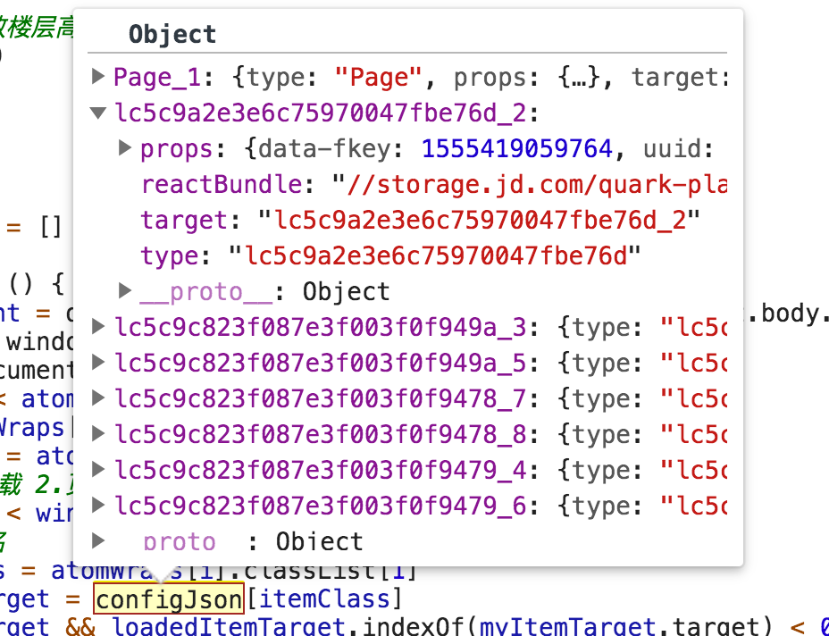
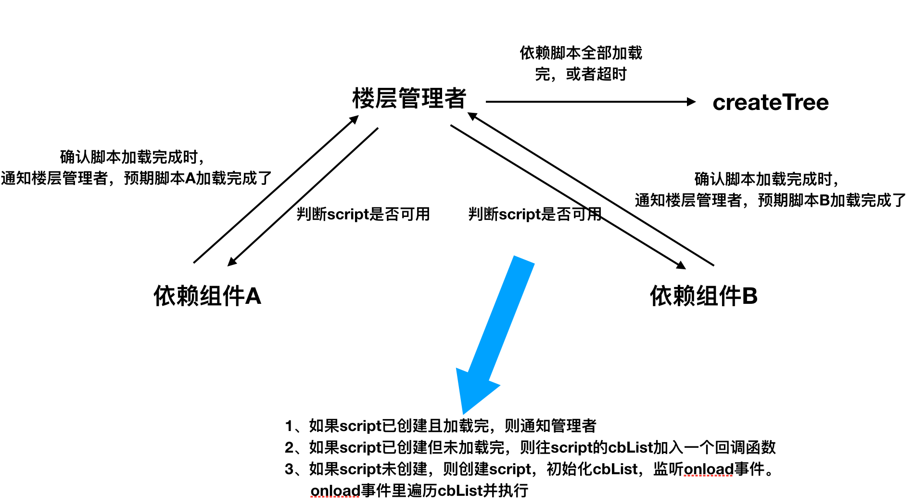

# 编译页面
## 骨架屏
- 页面生成的时候，就写入了骨架屏

- 页面上会有一个全局变量configJson

- 记录了组件和骨架屏的映射关系（真实要渲染的组件信息和骨架屏的关系—）

	- props
	- 组件代码包
	- 渲染时挂载的真实dom标识
	- 组件类型


## 如何判断什么时候加载真实dom
- 判断骨架dom是否满足top的条件
- 如果满足条件，则执行渲染逻辑
```
var bodyScrollHeight = document.documentElement.scrollTop || document.body.scrollTop
      var windowHeight = window.innerHeight
      var atomWraps = document.querySelectorAll('.atom-wrap')
      for (var i = 0; i < atomWraps.length; i++) {
        if (canLoad(atomWraps[i])) {
          var itemOffest = atomWraps[i].offsetTop
          // 1. 半屏提前加载 2.页面底部0高度占位也能渲染
          if (itemOffest < windowHeight * 1.5 + bodyScrollHeight) {
            // 获取节点类名
            var itemClass = atomWraps[i].classList[1]
            var myItemTarget = configJson[itemClass]
            if (myItemTarget && loadedItemTarget.indexOf(myItemTarget.target) < 0) {
              loadedItemTarget.push(myItemTarget.target)
              createTree(myItemTarget)
            }
          }
        }
      }
```
## 如何渲染真实dom

- 调用渲染之前，会先创建对应组件及其子组件所需要的代码脚本script
	- 去重：对组件及其子组件进行reduce操作，找出该节点所有依赖的组件 
	- 每个楼层都是一个原子，（每个楼层中的组件可能是嵌套类型的）都是一颗小的组件树。楼层的渲染必须等待该楼层依赖的所有组件script加载完成。
	- 确保script已创建及监听：
		- 每个楼层都对应有一个管理者，负责在执行回调函数渲染真实的组件（调用render方法） 
		- 从缓存中获取依赖组件的script。
		
		- 如果缓存中有这个script，并且已经load完，则立马执行回调函数
		- 如果缓存中没有，那么创建这个script并存到map中。
			- 有一个cbList对象，会存储依赖这个script的组件的回调渲染函数。
			- 监听onload事件，如果onload事件被调用或等待超时，则执行cbList
		- 等待script load完：上级管理者等到所有script都load或者达到超时阈值，就执行渲染
- 渲染：则调用渲染当前节点的一个回调函数：调用render和createElement
	
	
	
	```
	 function CountdownLatch (count, opts, cb) {
      this.count = count
      this.cb = cb
      var self = this
      if (opts.timeout) {
        this.timerId = setTimeout(function () {
          self.cb(true)
        }, opts.timeout)
      }
      if (count === 0) {
        this.cb()
      }
    }
    CountdownLatch.prototype.done = function () {
      if (this.count <= 0) {
        throw new Error('illegal state.')
      }
      this.count--
      if (this.count === 0) {
        this.timerId && clearTimeout(this.timerId)
        this.cb()
      }
    }

	// childs指的是当前楼层节点所依赖的所有组件，包括自己本身
	var countdown = new CountdownLatch(childs.length, {}, function () {
        create()
      })

      childs.forEach(function (child) {
        var bundle = child.reactBundle || ''
        if (!window.withoutCDNComponent) {
          bundle = bundle.replace('storage.jd.com', 'storage.360buyimg.com')
        }
        if(window.bundleMap[bundle] && window.bundleMap[bundle].loadDone) {
          countdown.done()
      	 } else {
	        downloadScript(bundle, ()=>{
	          countdown.done()
	        })
      	 }
      })
     
     // 脚本下载
  function downloadScript (bundle, cb) {
    if (bundle) {
      // 已经下载过则不重新下载
      if(!window.bundleMap) { window.bundleMap = {} }
      if(!window.bundleMap[bundle]) {
        var element = document.createElement('script')
        element.src = bundle
        var body = document.body || document.documentElement
        body.appendChild(element)
        window.bundleMap[bundle] = element
        
        if(!element.cbList) {
          element.cbList = [cb]
        }
        element.onload = function () {
          element.loadDone = true
          element.cbList.forEach((cb) => {
            cb()
          })
        }
      } else {
        var scriptFromMap =  window.bundleMap[bundle]
        scriptFromMap.cbList.push(cb)
      }
      return window.bundleMap[bundle]
    }
  }
	```
- 每个组件渲染时挂载的容器，对应的是骨架屏的dom。从上面的configJson取
	
	```
	 target.innerHTML = ''
	 
	  Nerv.render(
          Nerv.createElement(
            lingH5Utils.ErrorBoundary,
            { type: myItem.type, target: target },
            innerElement
          ),
          target
    )
	``` 


## 错误边界
- 给渲染的时候给每个组件包一个错误边界组件，真正的组件作为这个错误边界组件的子组件

```
 function create () {
        var innerElement = reduceRender(myItem)
        target.innerHTML = ''
        Nerv.render(
          Nerv.createElement(
            lingH5Utils.ErrorBoundary,
            { type: myItem.type, target: target },
            innerElement
          ),
          target,
          cb)
 }
```