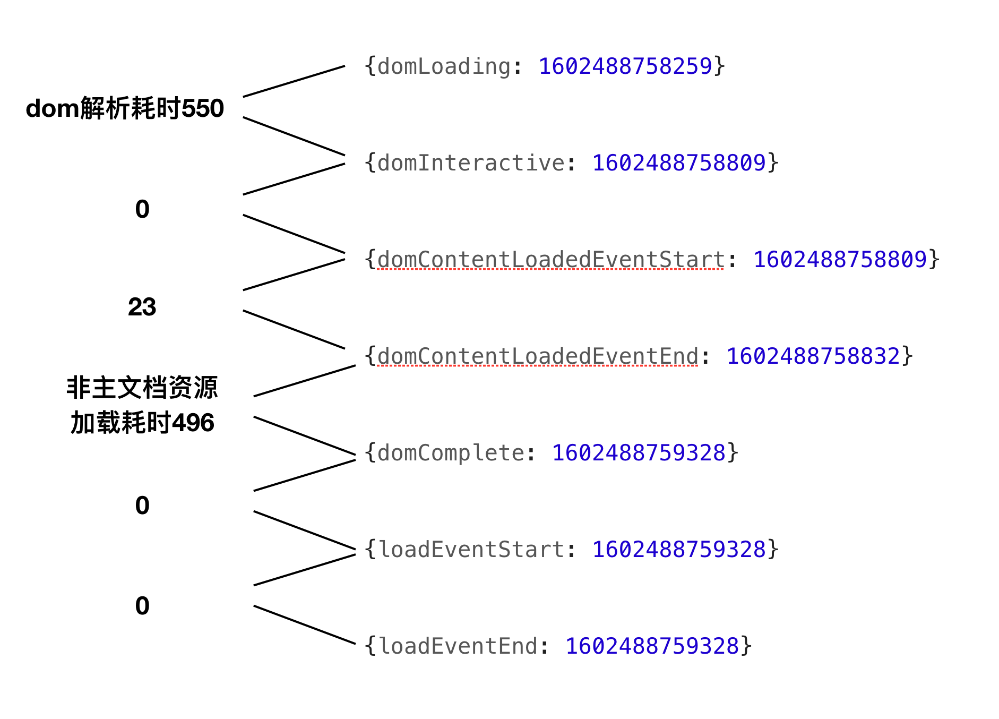

# atom编译后的页面的一些统计数据：

- 统计白屏FP=FCP 200毫秒
- dom树构建耗时： 500毫秒
- dom树构建完之后的其他资源加载耗时： 500毫秒
- 执行完onload的时间
	- 接近一秒
	- 因为onload事件中没有太多的计算？


# 一些时间节点

## DomLoading
（之前是网络请求获取html主文档的时间）
- 开始解析渲染 DOM 树的时间
- Document.readyState 变为 loading，并将抛出 readystatechange 相关事件
## DomInteractive
- 完成解析 DOM 树的时间
- Document.readyState 变为 interactive，并将抛出 readystatechange 相关事件
 `注意：只是 DOM 树解析完成，这时候并没有开始加载网页内的资源`
        
## DomContentLoadedEventStart
- DOM 解析完成后，网页内资源加载开始的时间(样式表、图片)
- 在 DOMContentLoaded 事件抛出前发生

## DomContentLoadedEventEnd
- DOM 解析完成后，且网页内资源加载完成的时间（如 图片、延迟的JS 脚本加载执行完毕）

## DomComplete
- DOM 树解析完成，且资源也准备就绪的时间，
- Document.readyState 变为 complete
- 将马上抛出 readystatechange 相关事件


- performance.navigation: 页面是加载还是刷新、发生了多少次重定向
- 同步 JavaScript 会暂停 DOM 的解析。
- 建议：
	- 把JavaScript 异步化
	- 优化样式表的加载, 由于被并行加载而减慢页面加载，从主 html 文档“窃取”流量。 

# 资源统计

```
const p = window.performance.getEntries();

// 过滤出script脚本
let jsR = p.filter(ele => ele.initiatorType === "script");
// 找出最大耗时
Math.max(...cssR.map((ele) => ele.responseEnd)) - Math.min(...cssR.map((ele) => ele.startTime));
```

# 从哪些方面优化和定位页面首屏时间过长
- 页面完全加载完毕的时间

	`times.loadPage = t.loadEventEnd - t.navigationStart;`
 
- 解析dom树的时间
	- 反思一下你的 DOM 树嵌套是不是太多了
	
	`times.domReady = t.domComplete - t.responseEnd;`

- 重定向时间
	- 拒绝重定向！比如，http://example.com/ 就不该写成 http://example.com

	`times.redirect = t.redirectEnd - t.redirectStart;`

-  DNS 查询时间
   - DNS 预加载做了么？页面内是不是使用了太多不同的域名导致域名查询的时间太长？
   - 可使用 HTML5 Prefetch 预查询 DNS ，见：[HTML5 prefetch](http://segmentfault.com/a/1190000000633364)    
 
	`times.lookupDomain = t.domainLookupEnd - t.domainLookupStart;`
	
- 读取页面第一个字节的时间
	- 这可以理解为用户拿到你的资源占用的时间
	- 加异地机房了么，加CDN 处理了么？加带宽了么？加 CPU 运算速度了么？ 

	`times.ttfb = t.responseStart - t.navigationStart;`
	
- 内容加载完成的时间
   - 页面内容经过 gzip 压缩了么，静态资源 css/js 等压缩了么？
   
   `times.request = t.responseEnd - t.requestStart;`
   
- 执行 onload 回调函数的时间
   - 是否太多不必要的操作都放到 onload 回调函数里执行了，考虑过延迟加载、按需加载的策略么？
    
   `times.loadEvent = t.loadEventEnd - t.loadEventStart;`
   
   
# 使用 performance.now() 精确计算程序执行时间
- 单位不同：
	- performance.now使用了一个浮点数来达到微秒级别的精确度
- 起始时间点不同：
	- performance.now() 相对于performance.timing.navigationStart(页面初始化) 的时间。
	- Date.now() 输出的是 UNIX 时间，即距离 1970 的时间，
- 准确性：
	- performance.now()  的时间是以恒定速率递增的，不受系统时间的影响（系统时间可被人为或软件调整，还可能遭到阻塞）
 	- Date.now()  会受系统程序执行阻塞的影响不同，

  